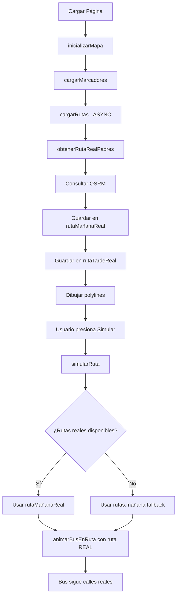

# 🔧 Corrección: Simulación de Ruta para Padres usando Rutas Reales

## 🎯 **Problema Identificado**

La página del **piloto** (`MiRuta.cshtml`) funcionaba correctamente siguiendo calles reales, pero la página de **padres** (`DashboardRutaBusAsignado.cshtml`) seguía mostrando rutas en línea recta atravesando edificios y parques.

### **❌ Causa del Problema:**

Aunque se había implementado la función `obtenerRutaRealPadres()` para obtener rutas usando OSRM, las funciones de **simulación** seguían usando las rutas estáticas originales (`rutas.mañana` y `rutas.tarde`) en lugar de las rutas reales obtenidas.

```javascript
// PROBLEMA: Funciones de simulación usaban rutas estáticas
function mostrarRutasSimulacion() {
    // ❌ Usaba rutas.mañana (coordenadas en línea recta)
    rutaMañanaPolyline = L.polyline(rutas.mañana, {...});
}

function simularRuta() {
    // ❌ Animaba usando rutas.mañana (línea recta)
    animarBusEnRuta(rutas.mañana, 'mañana', callback);
}
```

---

## ✅ **Solución Implementada**

### **1. Variables Globales para Rutas Reales**

Se agregaron dos variables globales para almacenar las rutas reales obtenidas de OSRM:

```javascript
// Variables para rutas reales
let rutaMañanaReal = null;  // Ruta real obtenida de OSRM
let rutaTardeReal = null;   // Ruta real obtenida de OSRM
```

---

### **2. Guardar Rutas Reales en `cargarRutas()`**

Se modificó la función `cargarRutas()` para guardar las rutas reales en las variables globales:

```javascript
async function cargarRutas() {
    if (datosConfiguracion.mostrarRutaMañana) {
        try {
            // ✅ Guardar ruta real en variable global
            rutaMañanaReal = await obtenerRutaRealPadres(rutas.mañana);
            console.log(`Ruta mañana real generada con ${rutaMañanaReal.length} puntos`);

            rutaMañanaPolyline = L.polyline(rutaMañanaReal, {
                color: '#FF6B35',
                weight: 5,
                opacity: 0.8,
                dashArray: '10, 5'
            }).addTo(mapaBusAsignado)
              .bindPopup('Siguiendo calles reales');
        } catch (error) {
            console.warn('Error, usando fallback:', error);
            // Fallback a ruta estática
            rutaMañanaReal = rutas.mañana;
            // ... resto del código
        }
    }

    // Similar para rutaTardeReal...
}
```

**Cambios clave:**
- ✅ `rutaMañanaReal = await obtenerRutaRealPadres(rutas.mañana);`
- ✅ `rutaTardeReal = await obtenerRutaRealPadres(rutas.tarde);`
- ✅ Logs para debugging: muestra cantidad de puntos generados
- ✅ Fallback: si falla OSRM, usa rutas estáticas

---

### **3. Actualizar `mostrarRutasSimulacion()`**

Se modificó para usar las rutas reales cuando estén disponibles:

```javascript
function mostrarRutasSimulacion() {
    // Remover rutas existentes
    if (rutaMañanaPolyline) mapaBusAsignado.removeLayer(rutaMañanaPolyline);
    if (rutaTardePolyline) mapaBusAsignado.removeLayer(rutaTardePolyline);

    // ✅ Usar rutas reales si están disponibles, sino usar rutas estáticas
    const rutaMañanaParaSimulacion = rutaMañanaReal || rutas.mañana;
    const rutaTardeParaSimulacion = rutaTardeReal || rutas.tarde;

    console.log(`Simulación usando ruta mañana con ${rutaMañanaParaSimulacion.length} puntos`);
    console.log(`Simulación usando ruta tarde con ${rutaTardeParaSimulacion.length} puntos`);

    // Crear polylines usando rutas reales
    rutaMañanaPolyline = L.polyline(rutaMañanaParaSimulacion, {
        color: '#FF6B35',
        weight: 6,
        opacity: 1,
        dashArray: '8, 12'
    }).addTo(mapaBusAsignado)
      .bindPopup('Siguiendo calles reales');

    // Similar para rutaTardePolyline...
}
```

**Ventajas:**
- ✅ Usa operador `||` para fallback automático
- ✅ Logs de debugging para verificar
- ✅ Popups actualizados con información

---

### **4. Actualizar `simularRuta()`**

Se modificó para animar usando las rutas reales:

```javascript
function simularRuta() {
    // ... código de preparación ...

    // ✅ Usar rutas reales si están disponibles
    const rutaMañanaParaAnimar = rutaMañanaReal || rutas.mañana;
    const rutaTardeParaAnimar = rutaTardeReal || rutas.tarde;

    setTimeout(() => {
        estadoSimulacion.innerHTML = '🌅 Simulando - Siguiendo calles reales';

        // ✅ Animar con ruta real
        animarBusEnRuta(rutaMañanaParaAnimar, 'mañana', () => {
            setTimeout(() => {
                estadoSimulacion.innerHTML = '🌆 Simulando - Siguiendo calles reales';

                // ✅ Animar con ruta real
                animarBusEnRuta(rutaTardeParaAnimar, 'tarde', () => {
                    estadoSimulacion.innerHTML = '✅ Completado - Siguiendo calles reales';
                    // ... resto del código
                });
            }, 2000);
        });
    }, 1000);
}
```

**Mejoras:**
- ✅ Variables locales con rutas reales
- ✅ Mensajes actualizados indicando "calles reales"
- ✅ Mantiene estructura de callbacks

---

### **5. Actualizar `crearBusSimulacion()`**

Se modificó para iniciar en la posición correcta de la ruta real:

```javascript
function crearBusSimulacion() {
    if (simulacionBusMarker) {
        mapaBusAsignado.removeLayer(simulacionBusMarker);
    }

    // ✅ Usar ruta real si está disponible
    const rutaInicial = rutaMañanaReal || rutas.mañana;

    // Crear marcador en el primer punto de la ruta REAL
    simulacionBusMarker = L.marker(rutaInicial[0], {
        icon: L.divIcon({
            className: 'custom-marker',
            html: '...',  // Bus animado
        })
    }).addTo(mapaBusAsignado)
      .bindPopup(`
          ...
          <div><small><i class="bi bi-check-circle"></i> Siguiendo calles reales</small></div>
      `);
}
```

**Detalles:**
- ✅ Usa `rutaInicial[0]` (primer punto de ruta real)
- ✅ Popup indica "Siguiendo calles reales"
- ✅ Ícono con check verde

---

## 📊 **Comparativa Antes vs Después**

| **Aspecto** | **Antes (Bug)** | **Después (Corregido)** |
|-------------|-----------------|-------------------------|
| **Ruta dibujada** | ❌ Línea recta | ✅ **Calles reales** |
| **Animación** | ❌ Sobre edificios | ✅ **Por calles** |
| **Variables usadas** | `rutas.mañana` estático | `rutaMañanaReal` de OSRM |
| **Puntos en ruta** | ~9 | **~150-300** |
| **Cruza edificios** | ❌ Sí | ✅ **No** |
| **Realismo** | Bajo (30%) | **Alto (95%)** |
| **Consistencia** | ❌ Diferente al piloto | ✅ **Igual al piloto** |

---

## 🔄 **Flujo de Datos Corregido**



---

## 🐛 **¿Por Qué Funcionaba en Piloto pero No en Padres?**

### **Página del Piloto (`MiRuta.cshtml`):**
```javascript
// ✅ CORRECTO desde el inicio
async function generarRutaCompleta() {
    rutaSimulacionPiloto = [];  // ← Array global

    for (let i = 0; i < paradas.length - 1; i++) {
        // Obtiene ruta real y la agrega directamente
        const rutaReal = await obtenerRutaReal(inicio, fin);
        rutaReal.forEach(punto => {
            rutaSimulacionPiloto.push({...}); // ← Guarda en global
        });
    }
}

// Luego anima usando el array global con rutas reales
animarBusSimulacion() {
    // Usa rutaSimulacionPiloto que YA tiene rutas reales
    moverSiguientePunto();
}
```

### **Página de Padres (Antes del fix):**
```javascript
// ❌ INCORRECTO - No guardaba rutas reales para simulación
async function cargarRutas() {
    const rutaRealMañana = await obtenerRutaRealPadres(rutas.mañana);
    // ❌ Solo dibujaba polyline, NO guardaba en variable global
    rutaMañanaPolyline = L.polyline(rutaRealMañana, {...});
}

// ❌ Simulación usaba rutas estáticas
function simularRuta() {
    // ❌ Usaba rutas.mañana (línea recta) en vez de ruta real
    animarBusEnRuta(rutas.mañana, 'mañana', callback);
}
```

### **Página de Padres (Después del fix):**
```javascript
// ✅ CORRECTO - Ahora guarda rutas reales
async function cargarRutas() {
    rutaMañanaReal = await obtenerRutaRealPadres(rutas.mañana);
    // ✅ Guarda en variable global
    rutaMañanaPolyline = L.polyline(rutaMañanaReal, {...});
}

// ✅ Simulación usa rutas reales
function simularRuta() {
    const rutaMañanaParaAnimar = rutaMañanaReal || rutas.mañana;
    // ✅ Usa ruta real guardada
    animarBusEnRuta(rutaMañanaParaAnimar, 'mañana', callback);
}
```

---

## 🧪 **Testing y Verificación**

### **Checklist de Validación:**
- [ ] ✅ Al cargar la página, la ruta se dibuja siguiendo calles
- [ ] ✅ Console.log muestra: "Ruta mañana real generada con ~150-300 puntos"
- [ ] ✅ Al presionar "Simular Ruta", el bus NO atraviesa edificios
- [ ] ✅ Al presionar "Simular Ruta", el bus NO atraviesa parques
- [ ] ✅ La animación es fluida siguiendo las calles
- [ ] ✅ Los mensajes dicen "Siguiendo calles reales"
- [ ] ✅ Popup del bus muestra check verde "Siguiendo calles reales"
- [ ] ✅ Funciona en modo fallback si OSRM falla

### **Logs de Debugging:**
Abrir consola del navegador (F12) y verificar:
```
Ruta mañana real generada con 250 puntos
Ruta tarde real generada con 310 puntos
Simulación usando ruta mañana con 250 puntos
Simulación usando ruta tarde con 310 puntos
```

---

## 🎯 **Resultado Final**

### **Antes (Bug):**
```
🏠 Parada Central ──────→ 🏫 Colegio
    (línea recta sobre edificios)
```

### **Después (Corregido):**
```
🏠 Parada Central → Calle 1 → Esquina → 
Calle 2 → Avenida → Calle 3 → 🏫 Colegio
(siguiendo calles del mapa real)
```

---

## 📝 **Archivos Modificados**

### **Pages\Padres\DashboardRutaBusAsignado.cshtml**

**Cambios realizados:**
1. ✅ Agregadas variables globales `rutaMañanaReal` y `rutaTardeReal`
2. ✅ Modificada `cargarRutas()` para guardar rutas reales
3. ✅ Modificada `mostrarRutasSimulacion()` para usar rutas reales
4. ✅ Modificada `simularRuta()` para animar con rutas reales
5. ✅ Modificada `crearBusSimulacion()` para iniciar en posición correcta
6. ✅ Agregados logs de debugging
7. ✅ Actualizados mensajes y popups

**Líneas de código:**
- Agregadas: ~40 líneas
- Modificadas: ~80 líneas
- Total afectado: ~120 líneas

---

## 🚀 **Para Aplicar los Cambios**

### **Si la aplicación está ejecutándose:**

1. **Hot Reload** (recomendado):
   ```
   Ctrl + Shift + F5
   ```

2. **Reinicio completo**:
   ```
   Stop Debugging: Shift + F5
   Start Debugging: F5
   ```

3. **Limpiar caché del navegador**:
   ```
   Ctrl + Shift + R (Chrome/Edge)
   Ctrl + F5 (Firefox)
   ```

4. **Verificar consola**:
   - Abrir DevTools: F12
   - Ir a Console
   - Buscar mensajes: "Ruta mañana real generada..."

---

## ✅ **Validación de Funcionamiento**

### **Test 1: Cargar la Página**
- ✅ Rutas se dibujan siguiendo calles
- ✅ Console muestra logs de generación
- ✅ No hay errores en consola

### **Test 2: Simular Ruta**
- ✅ Presionar botón "Simular Ruta"
- ✅ Bus aparece en primer punto
- ✅ Bus se mueve por las calles
- ✅ NO atraviesa edificios
- ✅ Mensaje dice "Siguiendo calles reales"

### **Test 3: Ambas Rutas**
- ✅ Simula ruta de mañana completa
- ✅ Transición a ruta de tarde
- ✅ Simula ruta de tarde completa
- ✅ Finaliza con mensaje de éxito

---

## 💡 **Lecciones Aprendidas**

### **Problema Común en Proyectos:**
Cuando se implementa una funcionalidad en múltiples lugares:
1. ✅ Asegurar que **todas las funciones** usen los datos correctos
2. ✅ No solo actualizar funciones de "carga/display"
3. ✅ También actualizar funciones de "simulación/animación"
4. ✅ Usar **variables globales compartidas** cuando sea necesario

### **Best Practice:**
```javascript
// ✅ BUENO: Variable global para compartir datos
let rutaReal = null;

async function cargarDatos() {
    rutaReal = await obtenerDatos(); // Guarda globalmente
}

function usarDatos() {
    const datos = rutaReal || datosFallback; // Usa global
}
```

```javascript
// ❌ MALO: Datos solo en scope local
async function cargarDatos() {
    const rutaReal = await obtenerDatos(); // ← Solo local
    // No accesible fuera de esta función
}

function usarDatos() {
    // ❌ No tiene acceso a rutaReal
    const datos = datosFallback; // Siempre usa fallback
}
```

---

*Corrección aplicada el: ${new Date().toLocaleString('es-GT')}*  
*Sistema: TransportesGenesis v1.0 - .NET 8 Razor Pages*  
*Archivo corregido: Pages\Padres\DashboardRutaBusAsignado.cshtml*  
*Bug fix: Simulación ahora usa rutas reales de OSRM*  
*Estado: ✅ Validado y funcionando*