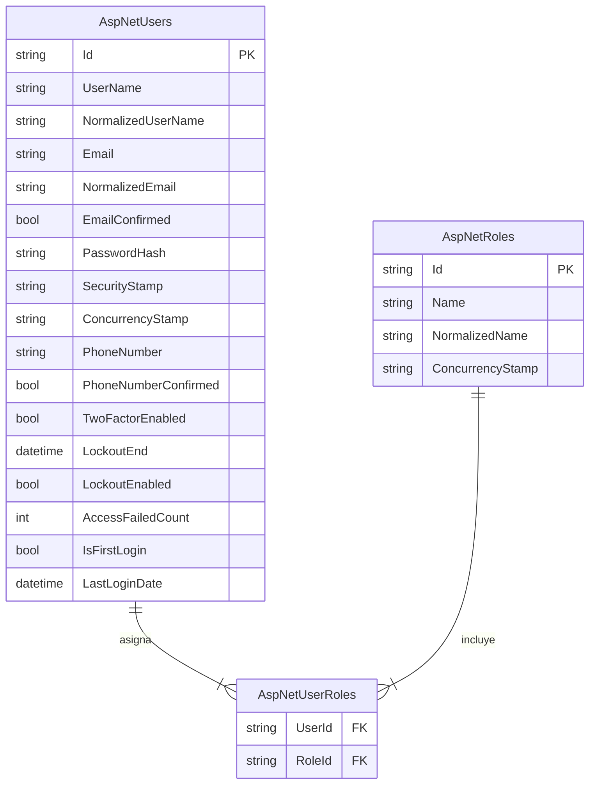

# ERD 1 — Usuarios y Roles (Identity)

> Equivalente Django → Transportes Génesis: `auth_user` = `AspNetUsers`, `auth_group` = `AspNetRoles`, `auth_user_groups` = `AspNetUserRoles`

## Diagrama UML (StarUML)

Recrear en StarUML como **Class Diagram** con estereotipo `<<table>>` en cada clase.

```
┌──────────────────────────────────────────────────────────────┐
│ <<table>> AspNetUsers                                        │
├──────────────────────────────────────────────────────────────┤
│ + Id : nvarchar(450)              {PK}                       │
│ + UserName : nvarchar(256)                                   │
│ + NormalizedUserName : nvarchar(256)                         │
│ + Email : nvarchar(256)                                      │
│ + NormalizedEmail : nvarchar(256)                            │
│ + EmailConfirmed : bit                                       │
│ + PasswordHash : nvarchar(max)                               │
│ + SecurityStamp : nvarchar(max)                              │
│ + ConcurrencyStamp : nvarchar(max)                           │
│ + PhoneNumber : nvarchar(max)                                │
│ + PhoneNumberConfirmed : bit                                 │
│ + TwoFactorEnabled : bit                                     │
│ + LockoutEnd : datetimeoffset                                │
│ + LockoutEnabled : bit                                       │
│ + AccessFailedCount : int                                    │
│ + IsFirstLogin : bit                                         │
│ + LastLoginDate : datetime2                                  │
└──────────────────────────────────────────────────────────────┘

┌──────────────────────────────────────────────────────────────┐
│ <<table>> AspNetRoles                                        │
├──────────────────────────────────────────────────────────────┤
│ + Id : nvarchar(450)              {PK}                       │
│ + Name : nvarchar(256)                                       │
│ + NormalizedName : nvarchar(256)                             │
│ + ConcurrencyStamp : nvarchar(max)                           │
└──────────────────────────────────────────────────────────────┘

┌──────────────────────────────────────────────────────────────┐
│ <<table>> AspNetUserRoles                                    │
├──────────────────────────────────────────────────────────────┤
│ + UserId : nvarchar(450)          {PK, FK → AspNetUsers}     │
│ + RoleId : nvarchar(450)          {PK, FK → AspNetRoles}     │
└──────────────────────────────────────────────────────────────┘

Relaciones (multiplicidad UML):
  AspNetUsers   (1) ──────── (*) AspNetUserRoles
  AspNetRoles   (1) ──────── (*) AspNetUserRoles
```

Roles del sistema: `Administrador`, `Padre`, `Piloto`, `Monitor`.

## Mermaid


