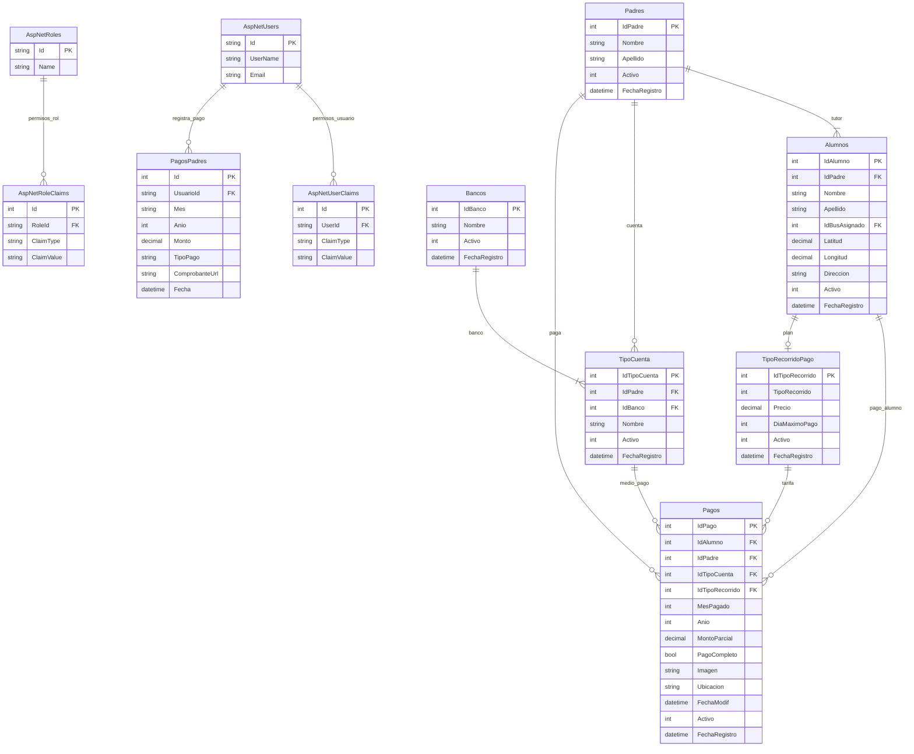

# ERD 2 — Permisos, Personas y Pagos

> Equivalente Django → Transportes Génesis:
> - `auth_permission` ≈ `AspNetRoleClaims` / `AspNetUserClaims`
> - `auth_user_user_permissions` ≈ `AspNetUserClaims`
> - Dominio de negocio: `Padres`, `Alumnos`, `Pagos`, catálogos de pago

## Diagrama UML (StarUML)

```
┌──────────────────────────────────────────────────────────────┐
│ <<table>> AspNetUsers                                        │
├──────────────────────────────────────────────────────────────┤
│ + Id : nvarchar(450)              {PK}                       │
│ + UserName : nvarchar(256)                                   │
│ + Email : nvarchar(256)                                      │
└──────────────────────────────────────────────────────────────┘

┌──────────────────────────────────────────────────────────────┐
│ <<table>> AspNetRoles                                        │
├──────────────────────────────────────────────────────────────┤
│ + Id : nvarchar(450)              {PK}                       │
│ + Name : nvarchar(256)                                       │
└──────────────────────────────────────────────────────────────┘

┌──────────────────────────────────────────────────────────────┐
│ <<table>> AspNetUserClaims                                   │
├──────────────────────────────────────────────────────────────┤
│ + Id : int                        {PK}                       │
│ + UserId : nvarchar(450)          {FK → AspNetUsers}         │
│ + ClaimType : nvarchar(max)                                  │
│ + ClaimValue : nvarchar(max)                                 │
└──────────────────────────────────────────────────────────────┘

┌──────────────────────────────────────────────────────────────┐
│ <<table>> AspNetRoleClaims                                    │
├──────────────────────────────────────────────────────────────┤
│ + Id : int                        {PK}                       │
│ + RoleId : nvarchar(450)          {FK → AspNetRoles}         │
│ + ClaimType : nvarchar(max)                                  │
│ + ClaimValue : nvarchar(max)                                 │
└──────────────────────────────────────────────────────────────┘

┌──────────────────────────────────────────────────────────────┐
│ <<table>> Padres                          schema genesis     │
├──────────────────────────────────────────────────────────────┤
│ + IdPadre : int                   {PK}                       │
│ + Nombre : nvarchar(50)                                      │
│ + Apellido : nvarchar(50)                                    │
│ + Activo : int                                               │
│ + FechaRegistro : datetime2                                  │
└──────────────────────────────────────────────────────────────┘

┌──────────────────────────────────────────────────────────────┐
│ <<table>> Alumnos                         schema genesis     │
├──────────────────────────────────────────────────────────────┤
│ + IdAlumno : int                  {PK}                       │
│ + IdPadre : int                   {FK → Padres}              │
│ + Nombre : nvarchar(max)                                     │
│ + Apellido : nvarchar(max)                                   │
│ + IdBusAsignado : int             {FK → Buses, 0..1}         │
│ + Latitud : decimal(10,7)                                    │
│ + Longitud : decimal(10,7)                                   │
│ + Direccion : nvarchar(250)                                  │
│ + Activo : int                                               │
│ + FechaRegistro : datetime2                                  │
└──────────────────────────────────────────────────────────────┘

┌──────────────────────────────────────────────────────────────┐
│ <<table>> Bancos                          schema genesis     │
├──────────────────────────────────────────────────────────────┤
│ + IdBanco : int                   {PK}                       │
│ + Nombre : nvarchar(50)                                      │
│ + Activo : int                                               │
│ + FechaRegistro : datetime2                                  │
└──────────────────────────────────────────────────────────────┘

┌──────────────────────────────────────────────────────────────┐
│ <<table>> TipoCuenta                      schema genesis     │
├──────────────────────────────────────────────────────────────┤
│ + IdTipoCuenta : int              {PK}                       │
│ + IdPadre : int                   {FK → Padres}              │
│ + IdBanco : int                   {FK → Bancos}              │
│ + Nombre : nvarchar(50)                                      │
│ + Activo : int                                               │
│ + FechaRegistro : datetime2                                  │
└──────────────────────────────────────────────────────────────┘

┌──────────────────────────────────────────────────────────────┐
│ <<table>> TipoRecorridoPago                schema genesis     │
├──────────────────────────────────────────────────────────────┤
│ + IdTipoRecorrido : int           {PK}                       │
│ + TipoRecorrido : int                                        │
│ + Precio : decimal(18,2)                                     │
│ + DiaMaximoPago : int                                        │
│ + Activo : int                                               │
│ + FechaRegistro : datetime2                                  │
└──────────────────────────────────────────────────────────────┘

┌──────────────────────────────────────────────────────────────┐
│ <<table>> Pagos                           schema genesis     │
├──────────────────────────────────────────────────────────────┤
│ + IdPago : int                    {PK}                       │
│ + IdAlumno : int                  {FK → Alumnos}             │
│ + IdPadre : int                   {FK → Padres}              │
│ + IdTipoCuenta : int              {FK → TipoCuenta}          │
│ + IdTipoRecorrido : int           {FK → TipoRecorridoPago}    │
│ + MesPagado : int                                            │
│ + Anio : int                                                 │
│ + MontoParcial : decimal(18,2)                             │
│ + PagoCompleto : bit                                         │
│ + Imagen : nvarchar(250)                                     │
│ + Ubicacion : nvarchar(500)                                  │
│ + FechaModif : datetime2                                     │
│ + Activo : int                                               │
│ + FechaRegistro : datetime2                                  │
└──────────────────────────────────────────────────────────────┘

┌──────────────────────────────────────────────────────────────┐
│ <<table>> PagosPadres                     schema dbo         │
├──────────────────────────────────────────────────────────────┤
│ + Id : int                        {PK}                       │
│ + UsuarioId : nvarchar(max)       {FK → AspNetUsers}         │
│ + Mes : nvarchar(max)                                        │
│ + Anio : int                                                 │
│ + Monto : decimal(18,2)                                      │
│ + TipoPago : nvarchar(max)                                   │
│ + ComprobanteUrl : nvarchar(max)                             │
│ + Fecha : datetime2                                          │
└──────────────────────────────────────────────────────────────┘

Relaciones (multiplicidad UML):
  AspNetUsers       (1) ──────── (0..*) AspNetUserClaims
  AspNetRoles       (1) ──────── (0..*) AspNetRoleClaims
  AspNetUsers       (1) ──────── (0..*) PagosPadres
  Padres            (1) ──────── (1..*) Alumnos
  Padres            (1) ──────── (0..*) TipoCuenta
  Padres            (1) ──────── (0..*) Pagos
  Bancos            (1) ──────── (1..*) TipoCuenta
  Alumnos           (1) ──────── (0..*) Pagos
  TipoCuenta        (1) ──────── (0..*) Pagos
  TipoRecorridoPago (1) ──────── (0..*) Pagos
  Alumnos           (1) ──────── (0..1) TipoRecorridoPago
```

## Mermaid


