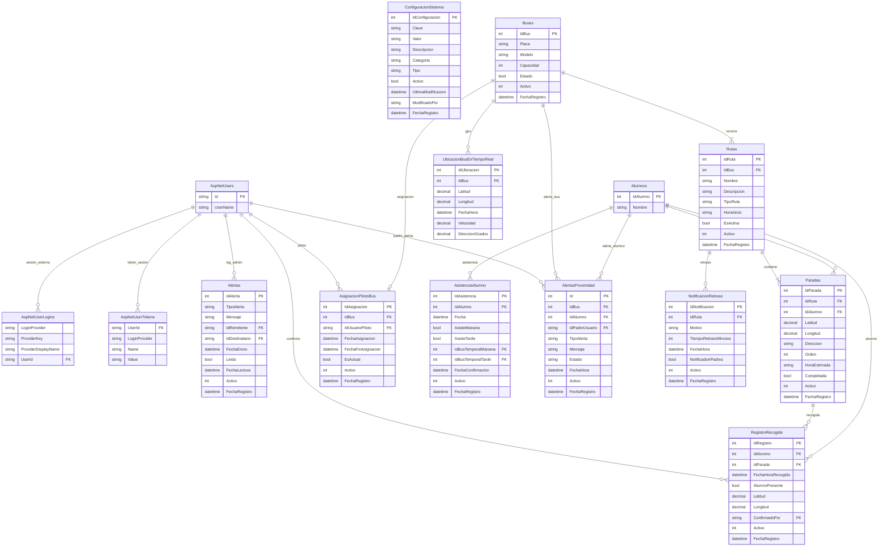

# ERD 3 — Administración, Sesiones y Geolocalización

> Equivalente Django → Transportes Génesis:
> - `django_session` ≈ `AspNetUserTokens` / `AspNetUserLogins`
> - `django_admin_log` ≈ `Alertas` + `ConfiguracionSistema`
> - Operaciones en vivo: buses, rutas, paradas, GPS, alertas

## Diagrama UML (StarUML)

```
┌──────────────────────────────────────────────────────────────┐
│ <<table>> AspNetUsers                                        │
├──────────────────────────────────────────────────────────────┤
│ + Id : nvarchar(450)              {PK}                       │
│ + UserName : nvarchar(256)                                   │
└──────────────────────────────────────────────────────────────┘

┌──────────────────────────────────────────────────────────────┐
│ <<table>> AspNetUserLogins                                   │
├──────────────────────────────────────────────────────────────┤
│ + LoginProvider : nvarchar(450)   {PK}                       │
│ + ProviderKey : nvarchar(450)     {PK}                       │
│ + ProviderDisplayName : nvarchar(max)                        │
│ + UserId : nvarchar(450)          {FK → AspNetUsers}         │
└──────────────────────────────────────────────────────────────┘

┌──────────────────────────────────────────────────────────────┐
│ <<table>> AspNetUserTokens                                   │
├──────────────────────────────────────────────────────────────┤
│ + UserId : nvarchar(450)          {PK, FK → AspNetUsers}     │
│ + LoginProvider : nvarchar(450)   {PK}                       │
│ + Name : nvarchar(450)              {PK}                       │
│ + Value : nvarchar(max)                                      │
└──────────────────────────────────────────────────────────────┘

┌──────────────────────────────────────────────────────────────┐
│ <<table>> ConfiguracionSistema            schema genesis     │
├──────────────────────────────────────────────────────────────┤
│ + IdConfiguracion : int           {PK}                       │
│ + Clave : nvarchar(100)                                      │
│ + Valor : nvarchar(max)                                      │
│ + Descripcion : nvarchar(500)                                │
│ + Categoria : nvarchar(50)                                   │
│ + Tipo : nvarchar(50)                                        │
│ + Activo : bit                                               │
│ + UltimaModificacion : datetime2                             │
│ + ModificadoPor : nvarchar(100)                              │
│ + FechaRegistro : datetime2                                  │
└──────────────────────────────────────────────────────────────┘

┌──────────────────────────────────────────────────────────────┐
│ <<table>> Alertas                         schema genesis     │
├──────────────────────────────────────────────────────────────┤
│ + IdAlerta : int                  {PK}                       │
│ + TipoAlerta : nvarchar(50)                                  │
│ + Mensaje : nvarchar(500)                                    │
│ + IdRemitente : nvarchar(450)     {FK → AspNetUsers, 0..1}   │
│ + IdDestinatario : nvarchar(450)  {FK → AspNetUsers, 0..1}   │
│ + FechaEnvio : datetime2                                     │
│ + Leida : bit                                                │
│ + FechaLectura : datetime2                                   │
│ + Activo : int                                               │
│ + FechaRegistro : datetime2                                  │
└──────────────────────────────────────────────────────────────┘

┌──────────────────────────────────────────────────────────────┐
│ <<table>> Buses                           schema genesis     │
├──────────────────────────────────────────────────────────────┤
│ + IdBus : int                     {PK}                       │
│ + Placa : nvarchar(20)                                       │
│ + Modelo : nvarchar(50)                                      │
│ + Capacidad : int                                            │
│ + Estado : bit                                               │
│ + Activo : int                                               │
│ + FechaRegistro : datetime2                                  │
└──────────────────────────────────────────────────────────────┘

┌──────────────────────────────────────────────────────────────┐
│ <<table>> Rutas                           schema genesis     │
├──────────────────────────────────────────────────────────────┤
│ + IdRuta : int                    {PK}                       │
│ + IdBus : int                     {FK → Buses}               │
│ + Nombre : nvarchar(100)                                     │
│ + Descripcion : nvarchar(250)                                │
│ + TipoRuta : nvarchar(10)                                    │
│ + HoraInicio : time                                          │
│ + EsActiva : bit                                             │
│ + Activo : int                                               │
│ + FechaRegistro : datetime2                                  │
└──────────────────────────────────────────────────────────────┘

┌──────────────────────────────────────────────────────────────┐
│ <<table>> Paradas                         schema genesis     │
├──────────────────────────────────────────────────────────────┤
│ + IdParada : int                  {PK}                       │
│ + IdRuta : int                    {FK → Rutas}               │
│ + IdAlumno : int                  {FK → Alumnos, 0..1}       │
│ + Latitud : decimal(10,7)                                    │
│ + Longitud : decimal(10,7)                                   │
│ + Direccion : nvarchar(250)                                  │
│ + Orden : int                                                │
│ + HoraEstimada : time                                        │
│ + Completada : bit                                           │
│ + Activo : int                                               │
│ + FechaRegistro : datetime2                                  │
└──────────────────────────────────────────────────────────────┘

┌──────────────────────────────────────────────────────────────┐
│ <<table>> AsignacionPilotoBus             schema genesis     │
├──────────────────────────────────────────────────────────────┤
│ + IdAsignacion : int              {PK}                       │
│ + IdBus : int                     {FK → Buses}               │
│ + IdUsuarioPiloto : nvarchar(450) {FK → AspNetUsers}         │
│ + FechaAsignacion : datetime2                                │
│ + FechaFinAsignacion : datetime2                             │
│ + EsActual : bit                                             │
│ + Activo : int                                               │
│ + FechaRegistro : datetime2                                  │
└──────────────────────────────────────────────────────────────┘

┌──────────────────────────────────────────────────────────────┐
│ <<table>> UbicacionBusEnTiempoReal        schema genesis     │
├──────────────────────────────────────────────────────────────┤
│ + IdUbicacion : int               {PK}                       │
│ + IdBus : int                     {FK → Buses}               │
│ + Latitud : decimal(10,7)                                    │
│ + Longitud : decimal(10,7)                                   │
│ + FechaHora : datetime2                                      │
│ + Velocidad : decimal(5,2)                                   │
│ + Direccion : decimal(5,2)                                   │
└──────────────────────────────────────────────────────────────┘

┌──────────────────────────────────────────────────────────────┐
│ <<table>> AsistenciaAlumno                schema genesis     │
├──────────────────────────────────────────────────────────────┤
│ + IdAsistencia : int              {PK}                       │
│ + IdAlumno : int                  {FK → Alumnos}             │
│ + Fecha : datetime2                                          │
│ + AsisteManana : bit                                         │
│ + AsisteTarde : bit                                          │
│ + IdBusTemporalManana : int       {FK → Buses, 0..1}         │
│ + IdBusTemporalTarde : int        {FK → Buses, 0..1}         │
│ + FechaConfirmacion : datetime2                              │
│ + Activo : int                                               │
│ + FechaRegistro : datetime2                                  │
└──────────────────────────────────────────────────────────────┘

┌──────────────────────────────────────────────────────────────┐
│ <<table>> RegistroRecogida                schema genesis     │
├──────────────────────────────────────────────────────────────┤
│ + IdRegistro : int                {PK}                       │
│ + IdAlumno : int                  {FK → Alumnos}             │
│ + IdParada : int                  {FK → Paradas}             │
│ + FechaHoraRecogida : datetime2                              │
│ + AlumnoPresente : bit                                       │
│ + Latitud : decimal(10,7)                                    │
│ + Longitud : decimal(10,7)                                   │
│ + ConfirmadoPor : nvarchar(450)   {FK → AspNetUsers, 0..1}   │
│ + Activo : int                                               │
│ + FechaRegistro : datetime2                                  │
└──────────────────────────────────────────────────────────────┘

┌──────────────────────────────────────────────────────────────┐
│ <<table>> AlertasProximidad               schema genesis     │
├──────────────────────────────────────────────────────────────┤
│ + Id : int                        {PK}                       │
│ + IdBus : int                     {FK → Buses}               │
│ + IdAlumno : int                  {FK → Alumnos, 0..1}       │
│ + IdPadre : nvarchar(450)        {FK → AspNetUsers, 0..1}    │
│ + TipoAlerta : varchar(20)                                   │
│ + Mensaje : nvarchar(500)                                    │
│ + Estado : varchar(15)                                       │
│ + FechaHora : datetime2                                      │
│ + Activo : int                                               │
│ + FechaRegistro : datetime2                                  │
└──────────────────────────────────────────────────────────────┘

┌──────────────────────────────────────────────────────────────┐
│ <<table>> NotificacionRetraso             schema genesis     │
├──────────────────────────────────────────────────────────────┤
│ + IdNotificacion : int            {PK}                       │
│ + IdRuta : int                    {FK → Rutas}               │
│ + Motivo : nvarchar(100)                                     │
│ + TiempoRetrasoMinutos : int                                 │
│ + FechaHora : datetime2                                      │
│ + NotificadoAPadres : bit                                    │
│ + Activo : int                                               │
│ + FechaRegistro : datetime2                                  │
└──────────────────────────────────────────────────────────────┘

Relaciones (multiplicidad UML):
  AspNetUsers  (1) ──────── (0..*) AspNetUserLogins
  AspNetUsers  (1) ──────── (0..*) AspNetUserTokens
  AspNetUsers  (1) ──────── (0..*) Alertas            [como remitente]
  AspNetUsers  (1) ──────── (0..*) Alertas            [como destinatario]
  AspNetUsers  (1) ──────── (0..*) AsignacionPilotoBus
  AspNetUsers  (1) ──────── (0..*) RegistroRecogida
  AspNetUsers  (1) ──────── (0..*) AlertasProximidad
  Buses        (1) ──────── (0..1) AsignacionPilotoBus
  Buses        (1) ──────── (1..*) Rutas
  Buses        (1) ──────── (0..*) UbicacionBusEnTiempoReal
  Buses        (1) ──────── (0..*) AlertasProximidad
  Rutas        (1) ──────── (1..*) Paradas
  Rutas        (1) ──────── (0..*) NotificacionRetraso
  Paradas      (1) ──────── (0..*) RegistroRecogida
  Alumnos      (1) ──────── (0..*) AsistenciaAlumno
  Alumnos      (1) ──────── (0..*) RegistroRecogida
```

## Mermaid


