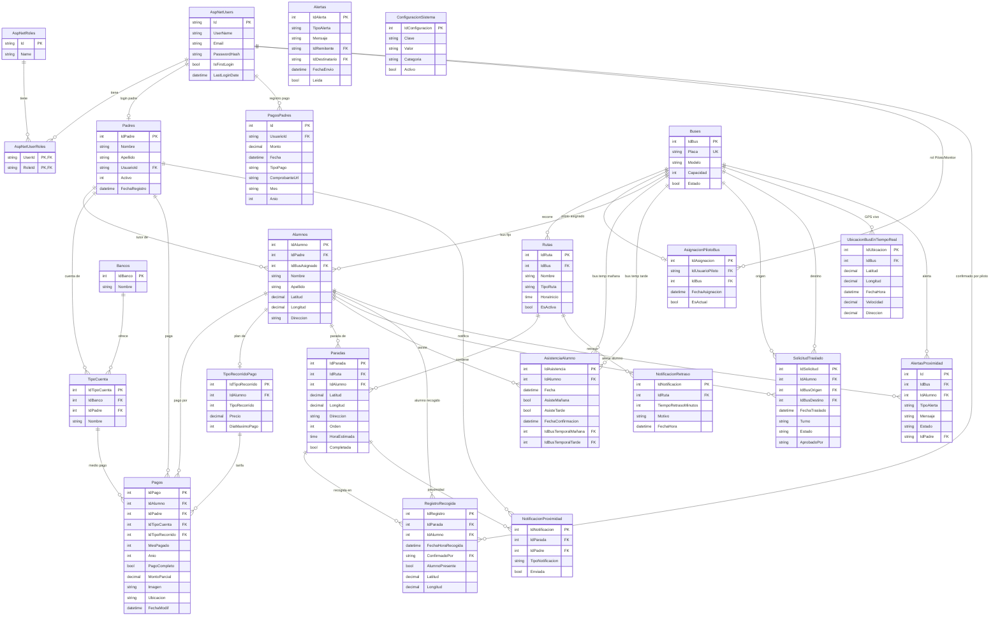
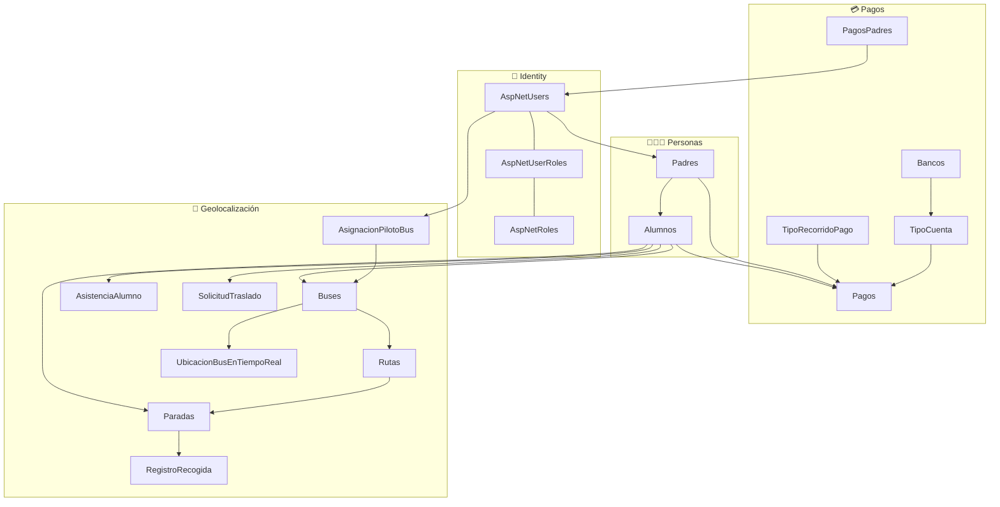

# ERD completo — Transportes Génesis (proyecto real)

Comparación con el diagrama de la presentación (solo geolocalización + `Pago` simplificado).

---

## Tablas que existen en el proyecto

### Identity (ASP.NET Core)

| Tabla | Esquema |
|-------|---------|
| `AspNetUsers` | dbo |
| `AspNetRoles` | dbo |
| `AspNetUserRoles` | dbo |
| `AspNetUserClaims` | dbo |
| `AspNetRoleClaims` | dbo |
| `AspNetUserLogins` | dbo |
| `AspNetUserTokens` | dbo |

### Negocio — Pagos (módulo compañero)

| Tabla | Esquema | Descripción |
|-------|---------|-------------|
| **`Pagos`** | genesis | Pago por alumno/padre, mes, comprobante, monto parcial |
| **`PagosPadres`** | dbo | Registro simplificado por usuario (Monto, TipoPago, ComprobanteUrl) |
| **`Bancos`** | genesis | Catálogo de bancos |
| **`TipoCuenta`** | genesis | Cuenta del padre ligada a banco |
| **`TipoRecorridoPago`** | genesis | Precio y día máximo de pago por tipo de recorrido/alumno |

### Negocio — Personas

| Tabla | Esquema |
|-------|---------|
| `Padres` | genesis |
| `Alumnos` | genesis |

### Negocio — Geolocalización / rutas

| Tabla | Esquema |
|-------|---------|
| `Buses` | genesis |
| `Rutas` | genesis |
| `Paradas` | genesis *(incluye `IdRuta`; no hay tabla `RutaParada` separada)* |
| `AsignacionPilotoBus` | genesis |
| `AsistenciaAlumno` | genesis *(equivale a “confirmación asistencia”)* |
| `UbicacionBusEnTiempoReal` | genesis |
| `RegistroRecogida` | genesis |
| `SolicitudTraslado` | genesis |
| `Alertas` | genesis |
| `AlertasProximidad` | genesis |
| `NotificacionProximidad` | genesis |
| `NotificacionRetraso` | genesis |
| `ConfiguracionSistema` | genesis *(coords colegio, etc.)* |

---

## Qué le falta al diagrama de tu amigo

| En su diagrama | En el proyecto real |
|----------------|---------------------|
| `Pago` simple | **`Pagos`** + **`PagosPadres`** + **`Bancos`** + **`TipoCuenta`** + **`TipoRecorridoPago`** |
| `RutaParada` (N:M) | **`Paradas.IdRuta`** directo (parada pertenece a una ruta) |
| `ConfirmacionAsistencia` | **`AsistenciaAlumno`** |
| — | **`UbicacionBusEnTiempoReal`**, **`SolicitudTraslado`**, **`Alertas*`**, **`ConfiguracionSistema`**, etc. |

---

## Diagrama Mermaid (copiar en [mermaid.live](https://mermaid.live) o en la presentación)

---

## Versión simplificada para diapositiva (solo bloques)

---

*Fuente: `ApplicationDbContext.cs`, modelos en `Models/DB/`, migraciones EF Core.*
