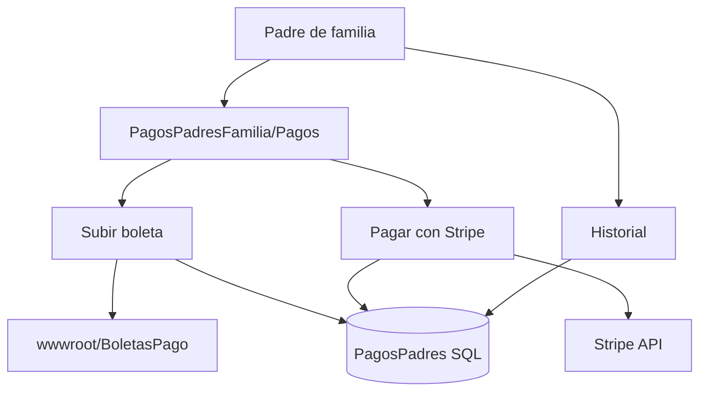
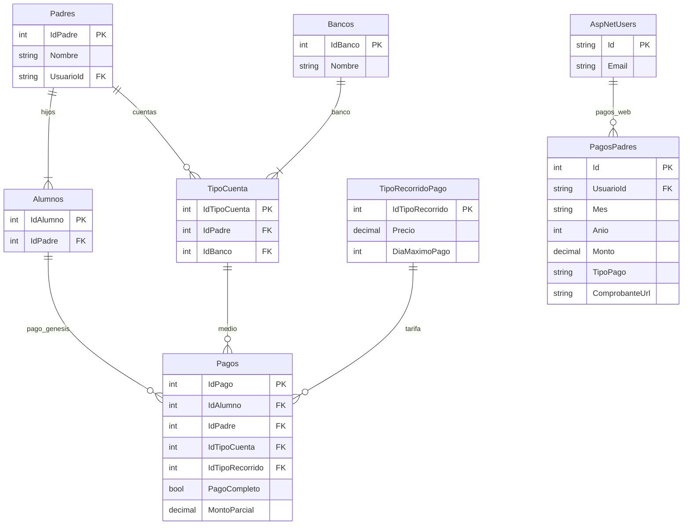

# Guía rápida — Transportes Génesis (para defensa / preguntas)

Documento de apoyo si te preguntan **qué hace cada parte del sistema** y **dónde está el módulo de pagos** (desarrollado por tu compañero).

---

## 1. ¿De qué trata el proyecto en una frase?

Plataforma web para una empresa de **transporte escolar**: administra rutas, paradas, asistencia, **pagos mensuales** y **ubicación del bus en vivo** para padres, pilotos y monitores.

**Tecnología general:** ASP.NET Core 8, SQL Server, Razor Pages + MVC, SignalR, Leaflet/OpenStreetMap.

---

## 2. Resumen por módulo (qué hace y dónde está)

| Módulo | ¿Qué hace? (simple) | Carpeta / archivos principales | Rol que lo usa |
|--------|---------------------|--------------------------------|----------------|
| **Login y usuarios** | Entrar al sistema, roles, contraseña | `Areas/Identity/Pages/Account/` | Todos |
| **Redirección al entrar** | Según rol manda a pagos, admin, piloto o monitor | `Controllers/HomeController.cs` | Sistema |
| **Administración** | Buses, paradas, rutas, alumnos, reportes | `Pages/Admin/` | Administrador |
| **Pagos** | Padre paga mes, sube boleta o paga con tarjeta | `Controllers/PagosPadresFamilia.cs`, `Views/PagosPadresFamilia/` | Padre |
| **Config. inicial padre** | Dirección del hijo en mapa (primera vez) | `Pages/Padre/ConfiguracionInicial.cshtml` | Padre |
| **Mapa en vivo (padre)** | Ve el bus moverse | `Pages/Padres/DashboardRutaBusAsignado.cshtml` | Padre |
| **Asistencia** | Padre confirma si el hijo va mañana/tarde | `Pages/Padres/ConfirmarAsistencia.cshtml` | Padre |
| **Traslados** | Solicitud de cambio de bus | `Pages/Padres/Traslados.cshtml` | Padre |
| **Piloto** | Ruta del día + envío de GPS | `Pages/Piloto/MiRuta.cshtml` | Piloto |
| **Monitor** | Ruta + simulación/registro en paradas | `Pages/Monitor/MiRuta.cshtml` | Monitor |
| **Geolocalización API** | Guardar y consultar posición del bus | `Controllers/Api/UbicacionesController.cs` | Piloto/Monitor → servidor |
| **Rutas API** | Ruta activa, completar parada | `Controllers/Api/RutasController.cs` | Piloto/Monitor |
| **Tiempo real** | Avisos al padre (ubicación, alertas) | `Hubs/NotificacionesHub.cs`, `wwwroot/js/signalr-client.js` | Padre / piloto |
| **Servicios geo** | Lógica GPS, alertas de cercanía | `Services/Implementations/UbicacionBusService.cs` | Backend |
| **Mapa general** | Vista admin/demo de flota | `Pages/Geolocalizacion/MapaEnTiempoReal.cshtml` | Admin / demo |
| **Base de datos** | Tablas y relaciones | `Models/DB/`, `Data/Context/ApplicationDbContext.cs`, `Migrations/` | — |

---

## 3. Flujo cuando alguien entra al sistema

```
Login (Identity)
    │
    ├─ PadreDeFamilia  →  /PagosPadresFamilia  (panel de pagos de tu amigo)
    ├─ Administrador   →  /Admin
    ├─ Piloto          →  /Piloto/MiRuta
    └─ Monitor         →  /Monitor/MiRuta
```

Código: `Controllers/HomeController.cs` (líneas 13–32).

El padre **también** puede ir al mapa del bus en:  
`/Padres/DashboardRutaBusAsignado` (módulo de geolocalización, no de pagos).

---

## 4. Módulo de PAGOS (detalle para preguntas)

**Responsable en el equipo (según planificador del proyecto):** Jonathan Villeda — autenticación + pagos.  
**Material de presentación de pagos:**  
`Documentos/Proyecto/final/Presentacion_16-06-2026/Gestion-de-Pagos-Transportes-Genesis.pptx`

### 4.1 ¿Qué problema resuelve?

- Antes: comprobantes por WhatsApp, Excel, difícil saber qué mes está pagado.
- Ahora: el padre registra el pago en la web, sube boleta o paga en línea, y ve su **historial**.

### 4.2 Importante: hay dos capas de pagos en la BD

| Capa | Tabla | ¿Para qué sirve? | ¿Tiene pantalla hoy? |
|------|-------|------------------|----------------------|
| **Pagos del padre (activo)** | `PagosPadres` (dbo) | Lo que usa el padre en la web: mes, monto, boleta o Stripe | **Sí** — MVC |
| **Pagos académicos / negocio** | `Pagos` (schema `genesis`) | Modelo más completo: alumno, padre, banco, tipo de cuenta, tipo de recorrido, imagen | **Modelo y migraciones**; UI admin completa limitada |

Si te preguntan “¿por qué dos tablas?”: la primera es el **flujo real del padre**; la segunda es el **modelo de negocio** que relaciona pago con alumno, banco y plan de recorrido (base para reportes o validación admin futura).

### 4.3 Pantallas del padre (MVC, no Razor Pages)

| URL | Vista | Función |
|-----|-------|---------|
| `/PagosPadresFamilia` | `Views/PagosPadresFamilia/Index.cshtml` | Menú: “Pagos” e “Historial” |
| `/PagosPadresFamilia/Pagos` | `Views/PagosPadresFamilia/Pagos.cshtml` | Subir boleta **o** pagar con tarjeta |
| `/PagosPadresFamilia/Historial` | `Views/PagosPadresFamilia/Historial.cshtml` | Lista de pagos del padre |

**Controlador único:** `Controllers/PagosPadresFamilia.cs`  
**Rol requerido:** `[Authorize(Roles = "PadreDeFamilia")]`

### 4.4 ¿Qué puede hacer el padre en pagos?

1. **Subir boleta (transferencia/depósito)**  
   - Formulario: mes, monto, archivo imagen.  
   - Se guarda en `wwwroot/BoletasPago/`.  
   - Acción: `SubirBoleta` en el controlador.

2. **Pagar en línea (Stripe)**  
   - Formulario con tarjeta (Stripe Elements en la vista).  
   - Acción: `PagarEnLinea` → crea `PaymentIntent` en Stripe.  
   - Guarda registro con `TipoPago = "Linea"` y `ComprobanteUrl = intent.Id`.

3. **Ver historial**  
   - Todos sus registros en `PagosPadres` filtrados por `UsuarioId`.

4. **Meses pendientes**  
   - El sistema calcula qué meses del año no están pagados y muestra alerta roja.

Regla mostrada en UI: *“Se tiene hasta el 5 de cada mes para hacer el pago”* (texto en la vista).

### 4.5 Modelos y tablas de pagos (archivos)

| Archivo | Contenido |
|---------|-----------|
| `Models/DB/Negocio/PagoPadre.cs` | Entidad de `PagosPadres` |
| `Models/DB/Negocio/Pago.cs` | Entidad `Pagos` (genesis) |
| `Models/DB/Negocio/Padres.cs` | Padres vinculados a alumnos y pagos genesis |
| `Models/DB/Negocio/Banco.cs` | Catálogo de bancos |
| `Models/DB/Negocio/TipoCuenta.cs` | Cuenta del padre en un banco |
| `Models/DB/Negocio/TipoRecorridoPago.cs` | Precio / día máximo según tipo de recorrido |
| `Models/DTO/PagoRequest.cs` | JSON para pago en línea (monto, mes) |
| `Models/Config/StripeSettings.cs` | Claves Stripe |
| `Data/Configuraciones/PagoConfig.cs` | Relaciones EF de `Pagos` |
| `Data/Configuraciones/BancoConfig.cs` | Config EF bancos |
| `Data/Configuraciones/TipoCuentaConfig.cs` | Config EF cuentas |
| `Data/Configuraciones/TipoRecorridoPagoConfig.cs` | Config EF tarifas |

**DbContext:** `Data/Context/ApplicationDbContext.cs`  
- `PagosPadres`  
- `PagosDb`, `BancosDb`, `TipoCuentasDb`, `TipoRecorridoPagosDb`, `PadresDb`

### 4.6 Migraciones relacionadas con pagos

| Migración | Qué creó |
|-----------|----------|
| `20241030190844_Create_TipoRecorridoPago_Banco_Padres_Alumnos_TipoCuentaEntity` | Bancos, Padres, Alumnos, TipoCuenta, TipoRecorridoPago |
| `20241030214842_Create_Pago_Entity` | Tabla `Pagos` (genesis) |
| `20260426174720_AddPagosPadres` | Tabla `PagosPadres` |
| `20260426185106_AddPagosPadresMesAnio` | Campos Mes y Anio en PagosPadres |

### 4.7 Stripe (pago en línea)

| Dónde | Qué |
|-------|-----|
| `TransportesGenesis.csproj` | Paquete `Stripe.net` |
| `Startup.cs` | Registro `StripeSettings` y `ApiKey` |
| `Views/PagosPadresFamilia/Pagos.cshtml` | Script `js.stripe.com` + Elements |
| `PagosPadresFamiliaController.PagarEnLinea` | `PaymentIntentCreateOptions`, moneda `gtq` |

Las claves Stripe van en configuración (`Stripe:PublishableKey`, `Stripe:SecretKey`), normalmente en `appsettings` o user secrets (no van al repositorio).

### 4.8 Diagrama simple del flujo de pagos (Mermaid)



### 4.9 Preguntas frecuentes sobre pagos (respuestas cortas)

**¿Cómo sabe el sistema qué mes falta?**  
Compara meses del año con los registros en `PagosPadres` del usuario (`Pagos()` en el controlador).

**¿El administrador confirma el pago?**  
En `PagosPadres` el flujo actual guarda el pago al subir boleta o al pagar Stripe; no hay pantalla admin dedicada como en el documento Word (estado Pendiente/Confirmado) para `PagosPadres`. El modelo `Pagos` (genesis) sí tiene campos como `PagoCompleto` para lógica más formal.

**¿Acepta efectivo?**  
El padre registra monto y sube comprobante; el “método” queda como `TipoPago = "Boleta"` o `"Linea"`.

**¿Está integrado con el mapa / geolocalización?**  
No. Pagos y geo son módulos separados. El padre entra primero a **pagos** al login; el mapa está en otra ruta (`DashboardRutaBusAsignado`).

**¿Quién hizo qué?**  
Pagos + login base: compañero (Jonathan). Geolocalización, rutas en vivo, SignalR, monitor/piloto: resto del equipo (incl. tu parte).

---

## 5. Módulo de GEOLOCALIZACIÓN (tu parte — resumen)

| Pregunta | Respuesta corta |
|----------|-----------------|
| ¿Google Maps? | **No.** OpenStreetMap + Leaflet |
| ¿Cómo llega la ubicación al padre? | GPS → `POST /api/ubicaciones` → BD → **SignalR** → mapa del padre |
| ¿Dónde ve el padre el bus? | `Pages/Padres/DashboardRutaBusAsignado.cshtml` |
| ¿Quién envía GPS? | `Pages/Piloto/MiRuta.cshtml`, `Pages/Monitor/MiRuta.cshtml` |
| Hub SignalR | `Hubs/NotificacionesHub.cs` → `/notificacionesHub` |
| Alertas “bus cerca” | `UbicacionBusService.cs` (distancia en metros, no polígonos) |

Más detalle: `Documentos/Geolocalizacion_Sesion_Demo_2026-06-14.md` y `Proyecto_Transportes_Genesis_v2_REVISION.md`.

---

## 6. Otros módulos en una línea

- **Rutas:** Admin calcula orden de paradas (`Pages/Admin/CalcularRutas.cshtml`) — algoritmo vecino más cercano, turnos Mañana/Tarde.
- **Asistencia:** `AsistenciaAlumno` — padre confirma en `ConfirmarAsistencia`.
- **Recogidas:** `RegistroRecogida` — al completar parada vía API de rutas.
- **Alertas:** `AlertasProximidad`, historial en `Pages/Admin/AlertasHistorial.cshtml`.
- **Identity:** roles `Administrador`, `Piloto`, `Monitor`, `PadreDeFamilia`.

---

## 7. Credenciales útiles para demo

| Rol | Usuario (ejemplo) | Notas |
|-----|-------------------|--------|
| Padre | `padre1@gmail.com` | Login → pagos; mapa en `/Padres/DashboardRutaBusAsignado` |
| Monitor | `monitor1@transportesgenesis.com` | Bus #4, transmisión en vivo |
| Admin | según seed del proyecto | Panel `/Admin` |
| Contraseña demo | `Admin123!` | Ver scripts / docs de demo |

---

## 8. Mapa mental: ¿dónde busco en el código?

```
TransportesGenesis/
├── Controllers/
│   ├── PagosPadresFamilia.cs     ← PAGOS (padre)
│   ├── HomeController.cs         ← redirección por rol
│   └── Api/
│       ├── UbicacionesController.cs   ← GEO
│       └── RutasController.cs
├── Views/
│   └── PagosPadresFamilia/       ← pantallas PAGOS
├── Pages/
│   ├── Admin/                    ← administración
│   ├── Padres/                   ← mapa, asistencia (padre)
│   ├── Padre/                    ← config inicial
│   ├── Piloto/ MiRuta            ← GEO
│   └── Monitor/ MiRuta             ← GEO
├── Models/DB/Negocio/            ← entidades (Pago, Bus, Ruta…)
├── Hubs/NotificacionesHub.cs     ← SignalR
├── Services/Implementations/     ← lógica de negocio
├── wwwroot/
│   ├── js/signalr-client.js
│   └── BoletasPago/              ← comprobantes subidos
└── Areas/Identity/               ← login
```

---

## 9. Si te piden un diagrama ER solo de pagos (Mermaid)



---

*Guía generada para la presentación del 16/06/2026. Ajusta nombres de integrantes si en tu equipo la división fue distinta.*
