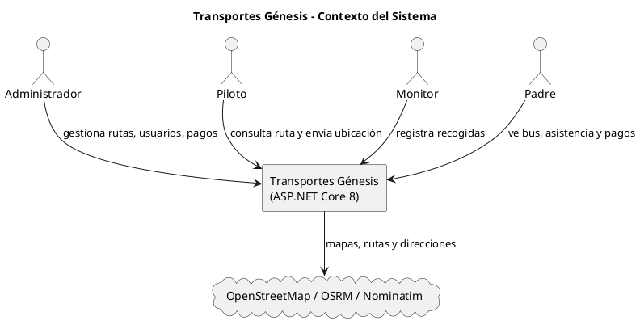
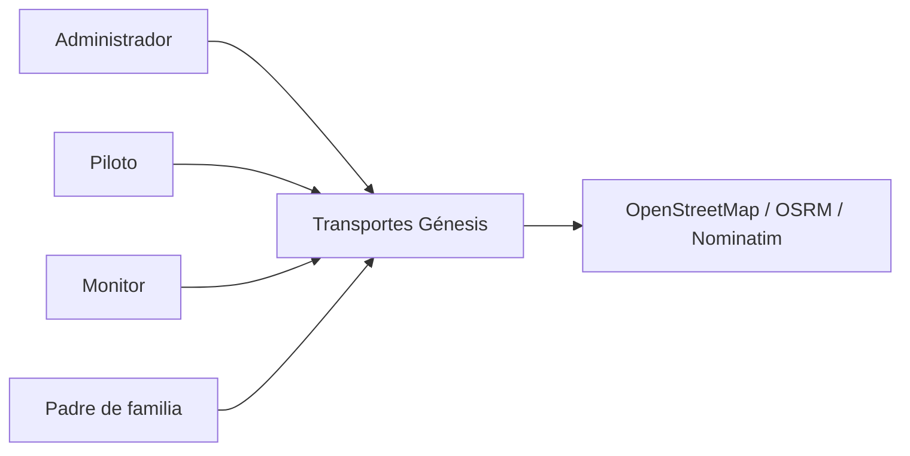
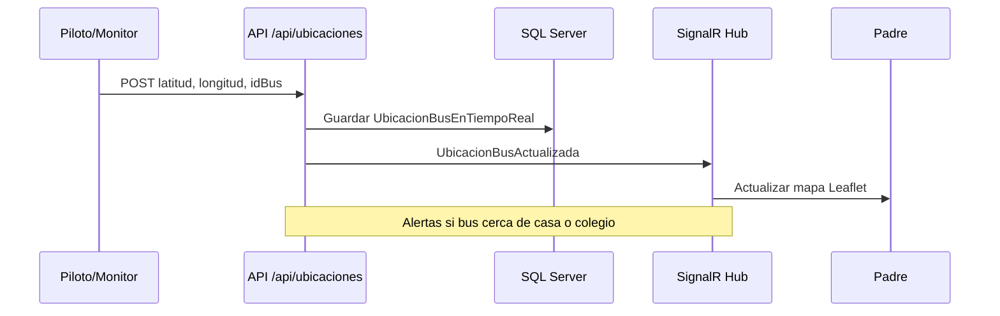
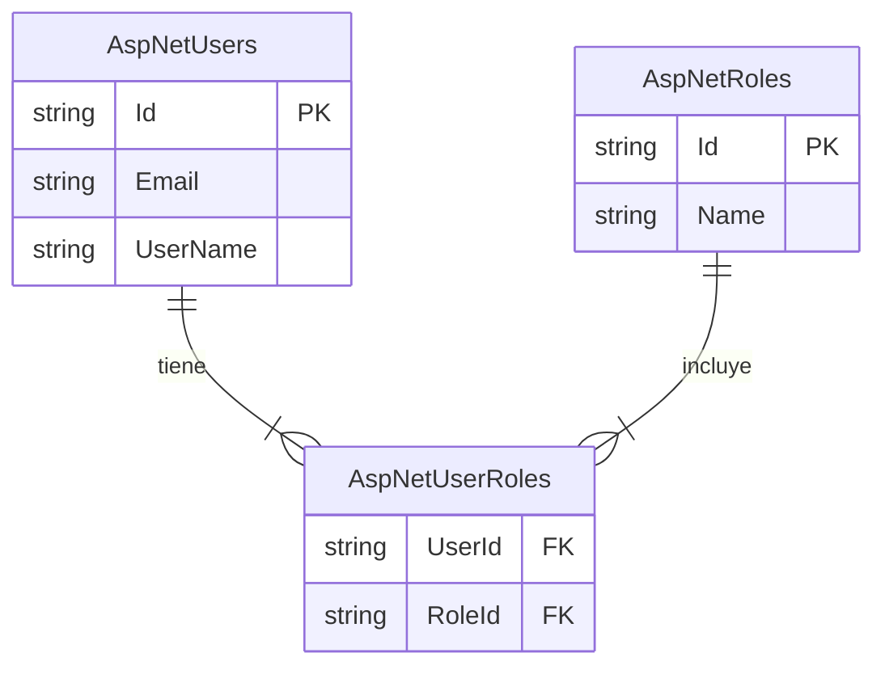
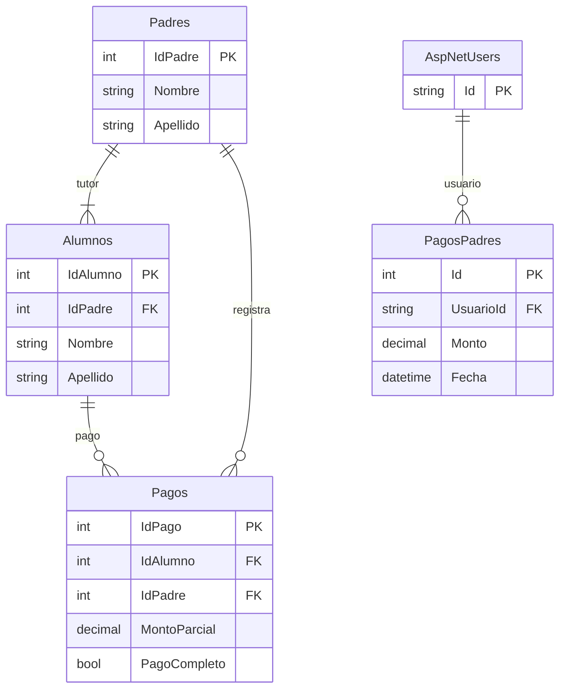
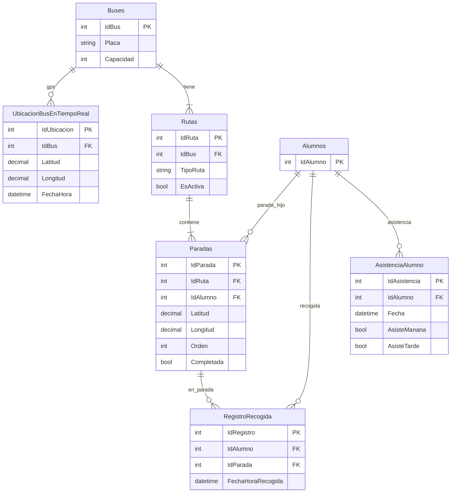
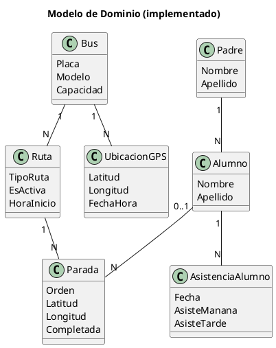

# Transportes Génesis — Revisión del documento v2

**Documento base:** `Proyecto_Transportes_Genesis_v2 (1).docx`  
**Fecha de revisión:** 16/06/2026  
**Objetivo:** Verificar coherencia con el sistema implementado, simplificar redacción y corregir inconsistencias.

---

## 1. Resumen de la revisión

El documento original está **bien estructurado** (alcance, requerimientos, arquitectura, costos), pero mezcla **lo planeado al inicio** con **lo que hoy existe en el repositorio**. Para la presentación conviene usar esta versión corregida.

### Coherente con el proyecto (mantener)

| Tema | Comentario |
|------|------------|
| Plataforma web .NET 8 + Razor Pages | Correcto |
| Roles: Administrador, Piloto, Monitor, Padre | Correcto |
| SQL Server + ASP.NET Core Identity | Correcto |
| SignalR para tiempo real | Correcto (hub `NotificacionesHub`) |
| Módulos: rutas, paradas, pagos, asistencia, recogidas | Correcto en líneas generales |
| Interfaz responsive (sin app nativa) | Correcto |

### Ajustes necesarios (corregidos abajo)

| En el Word dice… | En el proyecto real… |
|------------------|----------------------|
| **Google Maps API** obligatorio | **No se usa.** Mapas con **OpenStreetMap + Leaflet**; rutas con **OSRM**; direcciones con **Nominatim** (gratuito, sin API key) |
| Ubicación enviada **solo por SignalR** cada 10 s | Flujo real: **GPS → POST `/api/ubicaciones` → servidor → SignalR → padre** (en demo ~2 s) |
| Hub **`/geolocalizacionHub`** | Hub real: **`/notificacionesHub`** |
| Algoritmo **TSP completo** | **Vecino más cercano** (heurística), no TSP óptimo |
| Tablas **ParadaRuta**, **ConfirmacionAsistencia**, **AlumnoPadreFamilia**, **Empresa** | No existen así: `Paradas.IdRuta`, `AsistenciaAlumno`, `Padres`/`Alumnos.IdPadre`, sin tabla Empresa |
| **Geocercas poligonales** (en slides relacionadas) | **Alertas por radio** (Haversine): ~250 m casa, ~80 m colegio |
| Despliegue **solo Azure** vs texto **on‑premise** | El código funciona en ambos; el documento se contradice — usar “Azure **o** servidores propios” |
| Padre ve **todos los buses** de sus hijos | Hoy el dashboard muestra **un bus** (mejora pendiente) |
| Notificaciones **push** fuera de alcance | Correcto; las alertas son **en la web** vía SignalR |

---

## 2. Especificación funcional (lenguaje claro)

### 2.1 ¿Qué es el sistema?

**Transportes Génesis** es una plataforma web para empresas de transporte escolar. Centraliza rutas, pagos, asistencia y la **ubicación del bus en vivo**, conectando a administración, pilotos, monitores y padres de familia.

### 2.2 Problema que resuelve

- Rutas y pagos en papel o WhatsApp, difíciles de controlar.
- Los padres no saben dónde va el bus.
- Poca trazabilidad de recogidas y asistencias.
- Planificación de rutas lenta y poco eficiente.

### 2.3 Objetivos (redactados para no técnicos)

1. Digitalizar operaciones diarias en un solo sistema.
2. Calcular rutas de forma automática (orden de paradas optimizado).
3. Mostrar el bus en un mapa en tiempo casi real.
4. Registrar pagos, asistencias y recogidas con historial.
5. Dar a cada rol solo las pantallas que necesita.

### 2.4 Alcance v1.0 — incluido

- Inicio de sesión por roles y cambio de contraseña en primer acceso.
- Gestión de buses, alumnos, padres, paradas y rutas (mañana/tarde).
- Mapa con ruta y paradas para piloto, monitor y padre.
- Transmisión de ubicación del bus y actualización del mapa del padre sin recargar.
- Pagos: registro, comprobante, historial (tablas `Pagos` y `PagosPadres`).
- Confirmación de asistencia diaria (`AsistenciaAlumno`).
- Registro de recogidas por parada (`RegistroRecogida`).
- Panel administrativo y reportes básicos.

### 2.5 Fuera de alcance v1.0

- App nativa iOS/Android.
- Notificaciones push al teléfono (solo alertas dentro del navegador).
- Chat entre usuarios.
- Pasarela de pago en línea (Stripe, etc.) — diseñada a futuro.
- Mantenimiento mecánico de buses.

### 2.6 Usuarios

| Rol | Qué hace en el sistema |
|-----|-------------------------|
| **Administrador** | Usuarios, buses, rutas, paradas, pagos, reportes |
| **Piloto** | Ve su ruta y comparte ubicación del bus |
| **Monitor** | Ve ruta, completa paradas, registra recogidas |
| **Padre** | Ve mapa del bus, confirma asistencia, consulta pagos |

### 2.7 Flujo operativo diario (simplificado)

**Mañana — antes del recorrido**  
Padre confirma si el hijo asistirá → queda en `AsistenciaAlumno`.

**Durante el recorrido**  
Piloto/monitor envía GPS al servidor → padres ven el bus moverse en el mapa → monitor marca recogidas en cada parada.

**Pagos**  
Padre registra pago y sube comprobante → administración valida en el sistema.

---

## 3. Especificación técnica (alineada al código)

### 3.1 Stack tecnológico real

| Capa | Tecnología |
|------|------------|
| Backend | ASP.NET Core 8, Razor Pages, Web API |
| Base de datos | SQL Server, Entity Framework Core |
| Seguridad | ASP.NET Core Identity (roles) |
| Tiempo real | SignalR (`NotificacionesHub`) |
| Mapas | Leaflet.js + **OpenStreetMap** (tiles) |
| Rutas en calles | **OSRM** (`router.project-osrm.org`) |
| Direcciones → coordenadas | **Nominatim** (OpenStreetMap) |
| GPS del dispositivo | API Geolocation del navegador |
| Frontend | Bootstrap 5, JavaScript, jQuery |

> **Nota para la presentación:** No se requiere cuenta de Google Maps ni costo por mapas en v1.0.

### 3.2 Cómo funciona la geolocalización en vivo

```
Piloto/Monitor (navegador, GPS)
        │
        ▼
POST /api/ubicaciones  ──►  SQL Server (UbicacionBusEnTiempoReal)
        │
        ▼
SignalR NotificacionesHub  ──►  Grupos Bus_{id} / Alumno_{id}
        │
        ▼
Padre (mapa Leaflet se actualiza)
```

**Eventos SignalR principales:** `UbicacionBusActualizada`, `ParadaCompletada`, `AlertaRecibida`, `AlertaPersonal`.

**Alertas de cercanía:** distancia en línea recta (no polígonos): bus cerca de la casa del alumno o del colegio.

### 3.3 APIs REST implementadas (principales)

| Módulo | Ejemplos |
|--------|----------|
| Ubicaciones | `GET /api/ubicaciones/buses-activos`, `POST /api/ubicaciones`, `GET /api/ubicaciones/{idBus}/ultima` |
| Rutas | `GET /api/rutas/bus/{idBus}/activa`, `PUT /api/rutas/{idRuta}/parada/{idParada}/completar`, `POST /api/rutas/calcular` |

Autenticación: cookies de Identity + autorización por rol.

### 3.4 Cálculo de rutas

- Turnos **Mañana** y **Tarde** por bus.
- Orden de paradas: **algoritmo del vecino más cercano** (heurística).
- Horarios estimados según distancia y velocidad promedio (~30 km/h en reglas de negocio).
- En mapa, la línea sigue calles reales vía OSRM.

### 3.5 Infraestructura

El sistema puede desplegarse en **Azure** o en **servidores Windows propios** (IIS + .NET 8 + SQL Server). El Word original mezcla ambas opciones; para la entrega académica basta indicar el escenario que usen en demo (local o cloud).

---

## 4. Reglas de negocio (texto corregido)

| ID | Regla |
|----|--------|
| RN-01 | Un bus tiene una asignación de piloto activa (`AsignacionPilotoBus.EsActual`). |
| RN-02 | Cada parada en ruta puede vincularse a un alumno (`Paradas.IdAlumno`). |
| RN-03 | Una ruta activa por bus y turno (`Rutas.TipoRuta`, `EsActiva`). |
| RN-04 | La asistencia se confirma por día (`AsistenciaAlumno.Fecha`). |
| RN-05 | No duplicar recogida mismo alumno/parada/día. |
| RN-12 | El padre solo ve datos de sus hijos. |
| RN-14 | Ubicación “en vivo” si se actualiza cada pocos segundos (objetivo ≤10 s; demo ~2 s). |

---

## 5. Diagramas (código para PlantUML / Mermaid)

### 5.1 Contexto del sistema (C4 nivel 1) — PlantUML



### 5.2 Contexto — Mermaid



### 5.3 Flujo geolocalización en vivo — Mermaid



### 5.4 ER — Usuarios y roles — Mermaid



### 5.5 ER — Personas y pagos — Mermaid



### 5.6 ER — Rutas y geolocalización — Mermaid



### 5.7 Modelo de dominio simplificado — PlantUML



---

## 6. Texto sugerido para diapositiva “Monitoreo en tiempo real”

**Título:** Monitoreo en tiempo real — Comunicación SignalR

**Párrafo:**  
Usamos **SignalR** (sobre WebSockets) para que el padre vea la ubicación del bus casi al instante. El piloto o monitor envía el GPS al servidor; el servidor guarda la posición y avisa a los padres conectados.

**Tres tarjetas (corregidas):**

| Tarjeta | Texto sugerido |
|---------|----------------|
| **Actualización en vivo** | El mapa del padre se mueve cuando llega una nueva ubicación del bus. |
| **Alertas por cercanía** | Si el bus está cerca de la casa del alumno o del colegio, el sistema avisa automáticamente (radio en metros, no geocercas poligonales). |
| **Reconexión automática** | Si el padre pierde internet un momento, SignalR intenta reconectar y volver al grupo del bus. |

---

## 7. Checklist antes de presentar

- [ ] Decir **OpenStreetMap + Leaflet**, no Google Maps.
- [ ] Explicar flujo **API + SignalR**, no “SignalR directo desde el bus”.
- [ ] Mencionar **vecino más cercano**, no “TSP óptimo” salvo como objetivo futuro.
- [ ] Usar nombres de tablas reales: `AsistenciaAlumno`, `Paradas.IdRuta`.
- [ ] Demo: `monitor1@transportesgenesis.com` / `padre1@gmail.com` / bus asignado coherente.

---

*Repositorio: https://github.com/johnsvill/TransportesGenesis — Revisión basada en código y migraciones EF Core (junio 2026).*
