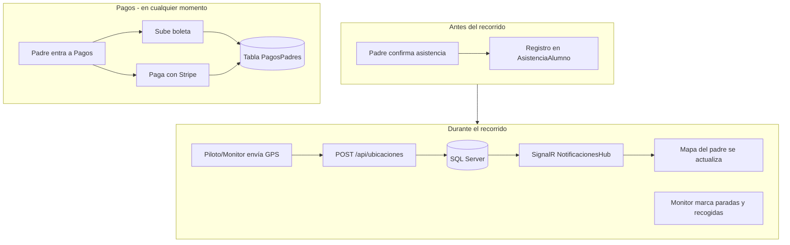
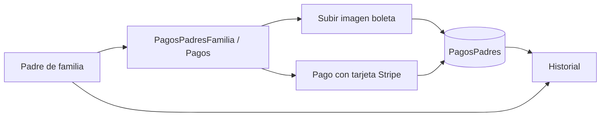
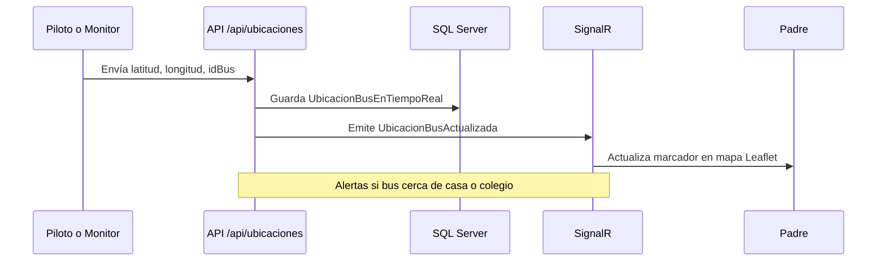
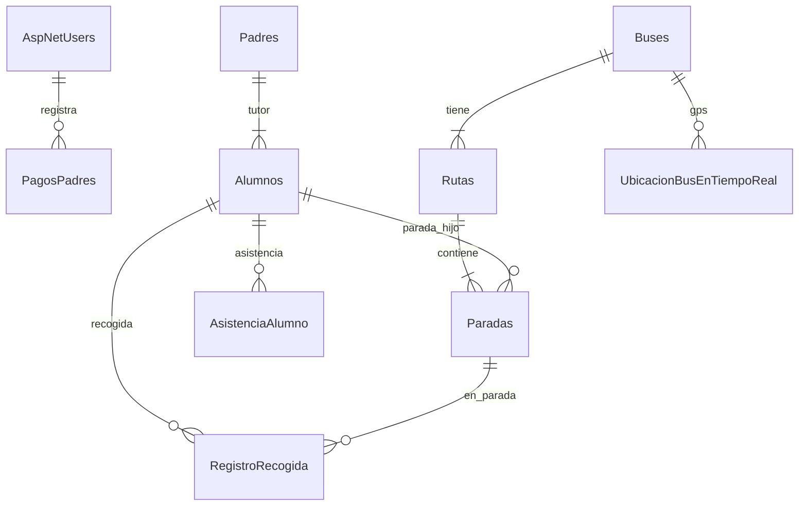
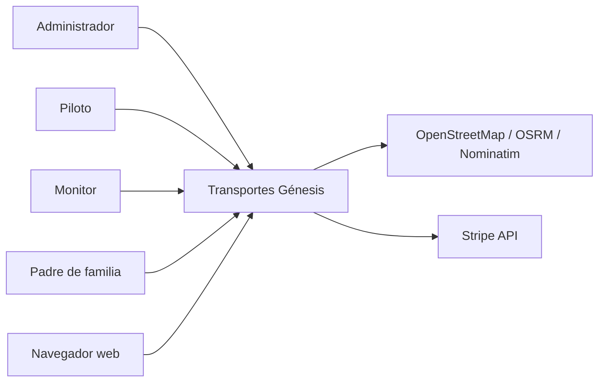
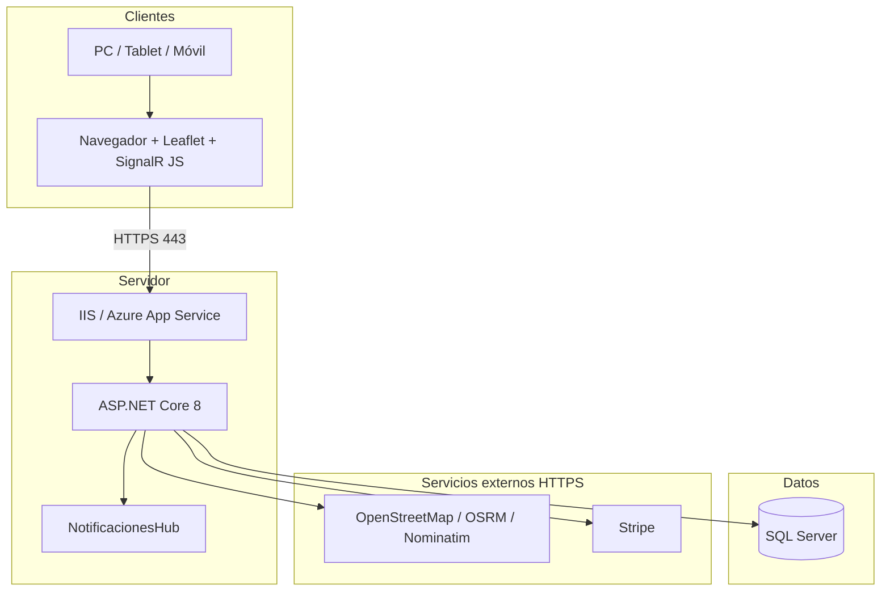
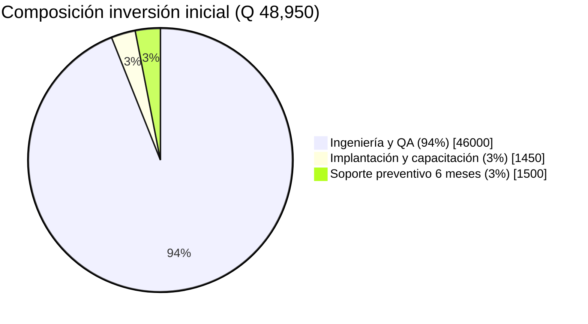
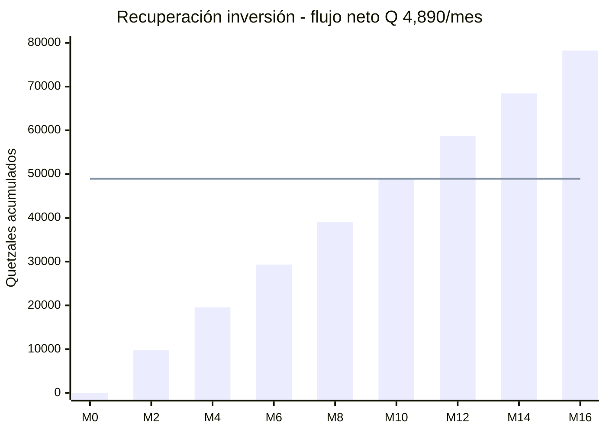
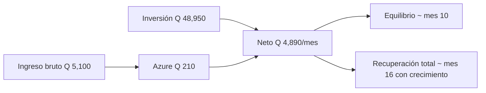

# Transportes Génesis — Especificación del Proyecto (v3.0)

**Tipo de documento:** Definición del alcance y especificación funcional, técnica y económica  
**Versión:** 3.0 (alineada al código implementado)  
**Fecha:** 20/06/2026  
**Documento base sustituido:** `Proyecto_Transportes_Genesis_v2 (1).docx`  
**Repositorio:** https://github.com/johnsvill/TransportesGenesis  

> Este documento refleja **lo que el sistema hace hoy** en el repositorio (junio 2026).  
> Donde el diseño original del Word v2 no coincide con la implementación, se indica explícitamente como *implementado*, *parcial* o *pendiente v2.0*.

---

## Contenido

1. [Especificación funcional](#1-especificación-funcional)
2. [Especificación técnica](#2-especificación-técnica)
3. [Especificación económica](#3-especificación-económica)
4. [Anexo: cambios respecto al Word v2](#4-anexo-cambios-respecto-al-word-v2)

---

# 1. ESPECIFICACIÓN FUNCIONAL

## 1.1 Introducción y alcance del sistema

### 1.1.1 Descripción general

**Transportes Génesis** es una plataforma web para empresas de transporte escolar. Centraliza en un solo lugar:

- Planificación y visualización de rutas (turnos mañana y tarde)
- Ubicación del bus en tiempo casi real para padres
- Registro de asistencias y recogidas
- Pagos mensuales (boleta o tarjeta en línea)
- Administración de buses, alumnos, paradas y personal

**Tecnología principal:** ASP.NET Core 8, SQL Server, Razor Pages + MVC, SignalR, mapas con OpenStreetMap y Leaflet.

**Usuarios conectados:** Administrador, Piloto, Monitor y Padre de familia.

---

### 1.1.2 Problema que resuelve

| Situación actual (manual) | Con el sistema |
|---------------------------|----------------|
| Rutas planificadas en Excel o “a ojo” | Orden de paradas calculado automáticamente |
| Padres preguntan por WhatsApp dónde va el bus | Mapa en vivo en la web |
| Comprobantes de pago perdidos en chats | Historial centralizado por padre |
| Listas de recogida en papel | Registro digital por parada |
| Poca trazabilidad de asistencias | Confirmación diaria del padre en el sistema |

---

### 1.1.3 Objetivos del proyecto

**Objetivos generales**

1. Digitalizar las operaciones diarias del transporte escolar.
2. Optimizar el orden de paradas con una heurística del **vecino más cercano** (no un TSP óptimo exhaustivo).
3. Mostrar la ubicación del bus en mapa con actualización casi instantánea.
4. Registrar pagos, asistencias y recogidas con historial.
5. Dar a cada rol solo las pantallas que necesita.

**Objetivos específicos implementados**

| Objetivo | Estado |
|----------|--------|
| Login por roles y cambio de contraseña en primer acceso | Implementado |
| Cálculo automático de rutas por turno | Implementado |
| Geolocalización en vivo (API + SignalR) | Implementado |
| Pagos: boleta + **Stripe en línea** | Implementado |
| Confirmación de asistencia diaria | Implementado |
| Registro de recogidas en ruta del monitor | Implementado |
| Panel admin y reportes básicos (rutas, asistencias, asignaciones) | Implementado |
| Solicitud de traslados entre buses | Implementado |
| Alertas cuando el bus está cerca de casa o colegio | Implementado |

---

### 1.1.4 Alcance del sistema v1.0

#### Dentro del alcance (implementado)

**Usuarios y seguridad**
- Login/logout con ASP.NET Core Identity
- Roles: Administrador, Piloto, Monitor, PadreDeFamilia
- Cambio de contraseña obligatorio en primer login (excepto administrador)

**Operación**
- CRUD de buses, alumnos, paradas y rutas
- Rutas Mañana y Tarde por bus
- Mapa con ruta y paradas para piloto, monitor y padre
- Transmisión GPS → servidor → mapa del padre (sin recargar página)

**Pagos**
- Panel del padre: `/PagosPadresFamilia`
- Subir boleta (mes, monto, imagen) → carpeta `BoletasPago`
- Pagar con tarjeta vía **Stripe** (moneda GTQ)
- Historial de pagos del padre
- Alerta de meses pendientes (Enero–Octubre)

**Asistencia y recogidas**
- Padre confirma asistencia mañana/tarde (`AsistenciaAlumno`)
- Monitor completa paradas y registra recogidas desde `MiRuta`

**Extras implementados**
- Configuración inicial del padre (dirección del alumno en mapa)
- Traslados de alumno entre buses (solicitud padre + gestión admin)
- Alertas de proximidad (~250 m casa, ~80 m colegio)

#### Fuera del alcance v1.0 (honesto con el código)

| Feature | Notas |
|---------|-------|
| App nativa iOS/Android | Solo web responsive |
| Notificaciones push al teléfono | Alertas dentro del navegador (SignalR) |
| Chat entre usuarios | No incluido |
| Validación admin de pagos (Pendiente/Confirmado/Rechazado) | Diseñado en Word v2; **no hay pantalla admin** en v1.0 |
| Webhooks Stripe y conciliación automática | Pendiente v2.0 |
| Reporte administrativo de pagos | Pendiente v2.0 |
| Monto automático según tarifa de recorrido | Padre ingresa monto manualmente |
| Multi-empresa (multi-tenancy) | Una sola empresa en v1.0 |
| Mantenimiento mecánico de buses | No incluido |

---

### 1.1.5 Beneficios esperados

**Para la empresa**
- Menos tiempo en planificación y seguimiento administrativo
- Rutas más ordenadas (ahorro estimado de combustible 20–30 % en operación optimizada)
- Trazabilidad de recogidas y asistencias
- Imagen moderna ante padres

**Para pilotos y monitores**
- Ruta clara del día en pantalla
- Registro digital en lugar de papel

**Para padres**
- Ver dónde va el bus
- Pagar o registrar comprobante desde casa
- Confirmar si el hijo asistirá

---

### 1.1.6 Usuarios del sistema

| Rol | Funciones principales |
|-----|----------------------|
| **Administrador** | Buses, paradas, rutas, alumnos, asignaciones, traslados, reportes, alertas |
| **Piloto** | Ver ruta del día y transmitir ubicación GPS |
| **Monitor** | Ver ruta, marcar paradas completadas, registrar recogidas |
| **Padre de familia** | Pagos, historial, mapa del bus, asistencia, traslados |

**Redirección al entrar (después del login):**

| Rol | Pantalla inicial |
|-----|------------------|
| PadreDeFamilia | `/PagosPadresFamilia` (panel de pagos) |
| Administrador | `/Admin` |
| Piloto | `/Piloto/MiRuta` |
| Monitor | `/Monitor/MiRuta` |

---

## 1.2 Contexto organizacional y flujos operativos

### 1.2.1 Flujo operativo propuesto (día típico)

### 1.2.2 Flujo de pagos (implementado v1.0)

**Importante:** En v1.0 el pago queda registrado al subir boleta o al procesar Stripe. **No existe** en el sistema un paso donde el administrador aprueba o rechaza el pago (eso quedó como mejora futura).

---

## 1.3 Requerimientos funcionales por módulo

Leyenda de estado: **✅ Implementado** · **⚠️ Parcial** · **❌ Pendiente v2.0**

### RF-01: Autenticación

| ID | Requerimiento | Estado |
|----|---------------|--------|
| RF-01.1 | Login con email y contraseña | ✅ |
| RF-01.2 | Cuatro roles con permisos diferenciados | ✅ |
| RF-01.3 | Cambio de contraseña en primer login | ✅ |
| RF-01.4 | Logout | ✅ |
| RF-01.5 | Redirección por rol al entrar | ✅ Padre → pagos (no mapa) |
| RF-01.6 | Mensaje si credenciales inválidas | ✅ |

---

### RF-02: Gestión de alumnos

| ID | Requerimiento | Estado |
|----|---------------|--------|
| RF-02.1 | CRUD de alumnos | ✅ |
| RF-02.2 | Vincular alumno con padre | ✅ Tabla `Padres` + `Alumnos.IdPadre` |
| RF-02.3 | Asignar alumno a parada/ruta | ✅ `Paradas.IdAlumno` |
| RF-02.4–02.6 | Listar, editar, eliminar | ✅ |

---

### RF-03: Paradas

| ID | Requerimiento | Estado |
|----|---------------|--------|
| RF-03.1 | Administrar paradas con orden en ruta | ✅ |
| RF-03.2 | Mapa interactivo al crear/editar | ✅ Leaflet + Nominatim |
| RF-03.3–03.5 | Listado y validación lat/lon | ✅ |

---

### RF-04: Cálculo de rutas

| ID | Requerimiento | Estado |
|----|---------------|--------|
| RF-04.1 | Calcular ruta automática por bus y turno | ✅ Heurística **vecino más cercano** |
| RF-04.2 | Turnos Mañana y Tarde | ✅ |
| RF-04.3 | Orden secuencial de paradas | ✅ Campo `Orden` en `Paradas` |
| RF-04.4 | Horarios estimados | ✅ |
| RF-04.7 | Mostrar ruta en mapa | ✅ OSRM traza calles reales |

> **Nota:** El Word v2 hablaba de “TSP óptimo”. En código se usa **Nearest Neighbor** (más rápido, suficiente para el volumen de paradas del proyecto).

---

### RF-05: Geolocalización en tiempo real

| ID | Requerimiento | Estado |
|----|---------------|--------|
| RF-05.1 | Piloto/monitor envía GPS | ✅ vía **`POST /api/ubicaciones`** (no solo SignalR) |
| RF-05.2 | Padre ve bus en mapa | ✅ Leaflet + OpenStreetMap |
| RF-05.3 | Ruta y paradas en el mapa | ✅ |
| RF-05.4 | Actualización sin recargar | ✅ SignalR `/notificacionesHub` |
| RF-05.5 | Aviso si bus no transmite | ⚠️ Mensajes en UI según última ubicación |
| RF-05.6 | Historial prolongado de GPS | ❌ Opcional / no prioritario |

**Flujo técnico simplificado:**

---

### RF-06: Pagos

| ID | Requerimiento | Estado |
|----|---------------|--------|
| RF-06.1 | Padre registra pago (monto, mes) | ✅ Sin estado Pendiente/Confirmado |
| RF-06.2 | Subir imagen de comprobante | ✅ En servidor local `wwwroot/BoletasPago` |
| RF-06.2b | Pago en línea con tarjeta | ✅ **Stripe** (GTQ) |
| RF-06.3 | Historial del padre | ✅ |
| RF-06.4 | Admin lista pagos pendientes | ❌ |
| RF-06.5 | Admin confirma pago | ❌ |
| RF-06.6 | Admin rechaza con motivo | ❌ |
| RF-06.7 | Filtros admin por alumno/fecha/estado | ❌ |
| RF-06.8 | Total ingresos por rango de fechas | ❌ |

**Dos tablas de pagos en base de datos:**

| Tabla | Uso |
|-------|-----|
| `PagosPadres` (dbo) | Flujo real del padre en la web |
| `Pagos` (schema genesis) | Modelo académico (alumno, banco, tarifa); sin UI admin completa |

---

### RF-07: Confirmación de asistencia

| ID | Requerimiento | Estado |
|----|---------------|--------|
| RF-07.1 | Padre confirma asistencia diaria | ✅ Tabla `AsistenciaAlumno` |
| RF-07.2 | Estado visible del día | ✅ |
| RF-07.3 | Piloto/monitor ve confirmaciones | ✅ |
| RF-07.4 | Límite de tiempo para cambiar | ⚠️ Parcial |
| RF-07.5 | Recordatorio automático | ❌ Futuro |

---

### RF-08: Registro de recogidas

| ID | Requerimiento | Estado |
|----|---------------|--------|
| RF-08.1 | Monitor ve ruta con alumnos | ✅ `Monitor/MiRuta` (no página separada RegistrarRecogidas) |
| RF-08.2–08.5 | Marcar recogidas, evitar duplicados | ✅ vía API de rutas |
| RF-08.6 | Reporte admin de recogidas | ⚠️ Parcial |

---

### RF-09: Dashboard y reportes

| Reporte | Estado |
|---------|--------|
| Dashboard admin | ✅ |
| Reporte de rutas (Excel) | ✅ |
| Reporte de asistencias (Excel) | ✅ |
| Reporte de asignaciones | ✅ |
| Reporte de pagos admin | ❌ Pendiente |

---

## 1.4 Requerimientos no funcionales (resumen)

| Área | Objetivo v1.0 |
|------|----------------|
| **Rendimiento** | Mapa actualizable cada pocos segundos; demo ~2 s |
| **Usabilidad** | Bootstrap 5, responsive, usable en móvil |
| **Seguridad** | Identity, roles, HTTPS, anti-CSRF en formularios |
| **Disponibilidad** | Uso en horario escolar; reconexión SignalR |
| **Compatibilidad** | Navegadores modernos (Chrome, Edge, Firefox, Safari) |

---

## 1.5 Modelo de dominio (implementado)

### Entidades principales

**Diferencias respecto al Word v2 (no usar en presentación):**

| Word v2 | Realidad en código |
|---------|-------------------|
| Tabla `Empresa` | No existe |
| `AlumnoPadreFamilia` (N:N) | `Padres` + `Alumnos.IdPadre` |
| `RutaParada` intermedia | `Paradas.IdRuta` + `Orden` |
| `ConfirmacionAsistencia` | `AsistenciaAlumno` |
| Google Maps | OpenStreetMap + Leaflet |

---

## 1.6 Reglas de negocio clave

| ID | Regla |
|----|--------|
| RN-01 | Un bus tiene una asignación de piloto activa (`EsActual`) |
| RN-02 | Paradas pueden vincularse a un alumno (`Paradas.IdAlumno`) |
| RN-03 | Una ruta activa por bus y turno |
| RN-04 | Asistencia se registra por día en `AsistenciaAlumno` |
| RN-05 | No duplicar recogida mismo alumno/parada/día |
| RN-06 | Padre solo ve datos de sus hijos |
| RN-07 | Meses de pago considerados: Enero–Octubre (año escolar) |
| RN-08 | Ubicación “en vivo” si se actualiza cada pocos segundos |

---

## 1.7 Restricciones y dependencias

### Restricciones técnicas (actualizadas)

| ID | Restricción |
|----|-------------|
| RES-TEC-01 | Desarrollo en .NET 8 |
| RES-TEC-02 | Base de datos SQL Server |
| RES-TEC-03 | Despliegue en **Azure o servidores Windows propios** (IIS + .NET 8) |
| RES-TEC-04 | Mapas con **OpenStreetMap + Leaflet + OSRM + Nominatim** (sin Google Maps en v1.0) |
| RES-TEC-05 | Tiempo real con SignalR |
| RES-TEC-06 | Aplicación web (no app nativa) |

### Dependencias externas

| Servicio | Función | Costo v1.0 |
|----------|---------|------------|
| OpenStreetMap | Tiles del mapa | Gratuito (política de uso) |
| OSRM | Rutas sobre calles | Gratuito en demo pública |
| Nominatim | Dirección → coordenadas | Gratuito (límites de tasa) |
| Stripe | Pagos con tarjeta | Comisión por transacción |
| SignalR | Parte de ASP.NET Core | Sin costo extra |

> **Eliminado respecto al Word v2:** dependencia crítica de Google Maps API y costo mensual asociado.

---

# 2. ESPECIFICACIÓN TÉCNICA

## 2.1 Arquitectura de referencia

### 2.1.1 Diagrama C4 — Contexto del sistema

---

### 2.1.2 Contenedores

| Contenedor | Tecnología | Responsabilidad |
|------------|------------|-----------------|
| Web Application | ASP.NET Core 8 (Razor Pages + MVC Views) | UI y lógica de presentación |
| API REST | Controllers en `/api/*` | Ubicaciones, rutas, asistencia, alertas, traslados |
| SignalR Hub | `NotificacionesHub` en `/notificacionesHub` | Tiempo real hacia padres y operadores |
| Base de datos | SQL Server + EF Core | Esquemas `genesis` (negocio) y `dbo` (Identity) |
| Cliente web | HTML, Bootstrap 5, JavaScript, Leaflet | Interfaz en navegador |

---

### 2.1.3 Componentes principales por rol

| Rol | Pantallas principales |
|-----|----------------------|
| **Admin** | Dashboard, CalcularRutas, GestionarAlumnos, GestionarParadas, GestionarAsignaciones, GestionarTraslados, AlertasHistorial, reportes Excel |
| **Piloto** | `Piloto/MiRuta` — ruta + transmisión GPS |
| **Monitor** | `Monitor/MiRuta` — ruta + paradas + recogidas |
| **Padre** | MVC `PagosPadresFamilia/*` + `Padres/DashboardRutaBusAsignado`, `ConfirmarAsistencia`, `Traslados` + `Padre/ConfiguracionInicial` |
| **Demo geo** | `Geolocalizacion/MapaEnTiempoReal` |

**Pagos del padre:** implementados en **MVC** (`Controllers/PagosPadresFamilia.cs`, `Views/PagosPadresFamilia/`), no como Razor Page.

---

### 2.1.4 Estilo arquitectónico

- **Razor Pages** para la mayoría de pantallas operativas
- **MVC Controllers + Views** para el módulo de pagos del padre
- **Web API** para operaciones consumidas por JavaScript (GPS, rutas, alertas)
- **SignalR** para push al cliente después de persistir en servidor
- **Capas:** Presentación → Servicios/Repositorios → EF Core → SQL Server

---

### 2.1.5 Diagrama de despliegue (simplificado)

---

## 2.2 Stack tecnológico

### Backend

| Tecnología | Versión | Uso |
|------------|---------|-----|
| .NET | 8.0 LTS | Plataforma |
| ASP.NET Core | 8.0 | Web + API |
| Entity Framework Core | 8.0 | Acceso a datos |
| ASP.NET Core Identity | 8.0 | Usuarios y roles |
| SignalR | 8.0 | Tiempo real |
| Stripe.net | NuGet | Pagos en línea |

### Frontend y mapas

| Tecnología | Uso |
|------------|-----|
| Bootstrap 5 | UI responsive |
| Leaflet.js 1.9 | Mapas interactivos |
| OpenStreetMap | Capa de tiles |
| OSRM + leaflet-routing-machine | Línea de ruta en calles |
| Nominatim | Búsqueda de direcciones |
| JavaScript / jQuery | Interacción cliente |
| Stripe.js Elements | Formulario de tarjeta |

### Base de datos e infraestructura

| Tecnología | Uso |
|------------|-----|
| SQL Server 2019+ | Persistencia |
| IIS / Kestrel | Hosting |
| Azure App Service | Opcional (cloud) |
| Windows Server + SQL local | Opcional (on-premise / demo) |

---

## 2.3 APIs REST principales

| Módulo | Ejemplos de endpoint |
|--------|---------------------|
| Ubicaciones | `GET /api/ubicaciones/buses-activos`, `POST /api/ubicaciones`, `GET /api/ubicaciones/{idBus}/ultima` |
| Rutas | `GET /api/rutas/bus/{idBus}/activa`, `PUT .../completar`, `POST /api/rutas/calcular` |
| Asistencia | `/api/asistencia/*` |
| Alertas | `/api/alertas/*` |
| Traslados | `/api/traslados/*` |
| Paradas | `/api/paradas/*` |

**Pagos:** no hay API REST dedicada. Endpoints MVC:

- `POST /PagosPadresFamilia/PagarEnLinea` (JSON — Stripe)
- `POST /PagosPadresFamilia/SubirBoleta` (formulario con archivo)

Autenticación: cookies de Identity + autorización por rol.

---

## 2.4 SignalR — tiempo real

| Elemento | Valor real |
|----------|------------|
| Hub | `NotificacionesHub.cs` |
| URL | `/notificacionesHub` |
| Grupos | `Bus_{idBus}`, `Alumno_{id}` |
| Eventos | `UbicacionBusActualizada`, `ParadaCompletada`, `AlertaRecibida`, `AlertaPersonal` |

**Flujo correcto (no decir “SignalR envía el GPS directo”):**

1. Piloto/monitor obtiene coordenadas del navegador (Geolocation API).
2. Cliente hace `POST /api/ubicaciones`.
3. Servidor guarda en BD y emite evento SignalR.
4. Padre recibe evento y mueve el marcador en Leaflet.

---

## 2.5 Cálculo de rutas

- Turnos **Mañana** (termina en colegio) y **Tarde** (empieza en colegio).
- Algoritmo: **vecino más cercano** sobre alumnos con asistencia confirmada.
- Velocidad de referencia ~30 km/h para horarios estimados.
- Visualización en mapa: geometría real vía OSRM.

---

## 2.6 Patrones y estrategia de testing

> Esta sección describe **cómo se prueba**, sin código. El Word v2 incluía ejemplos de código que no corresponden a un documento de alcance.

### Testing unitario

| Aspecto | Enfoque |
|---------|---------|
| Framework | xUnit + Moq (donde aplique) |
| Qué probar | Servicios de rutas, validaciones de negocio, repositorios críticos |
| Base de datos en tests | Base en memoria (EF Core InMemory) o SQL local de prueba |
| Cobertura objetivo | > 70 % en lógica de negocio crítica |
| Ejemplos de casos | Cálculo de paradas con 0, 1 y N alumnos; no duplicar recogida; filtro de asistencia |

### Testing de integración / API

| Aspecto | Enfoque |
|---------|---------|
| Herramienta | Postman o pruebas automatizadas contra `/api/*` |
| Escenarios | Registrar ubicación → consultar última; completar parada; confirmar asistencia |
| Autenticación | Cookie de sesión o usuario de prueba por rol |

### Testing end-to-end (E2E)

| Aspecto | Enfoque |
|---------|---------|
| Herramienta | Playwright o Selenium |
| Escenarios típicos | Login por rol → pantalla esperada; padre sube boleta; piloto inicia transmisión; padre ve mapa |
| Datos | Usuarios seed (ej. padre1@gmail.com, monitor1@transportesgenesis.com) |

### Testing manual (demo / defensa)

| Escenario | Pasos resumidos |
|-----------|-----------------|
| Pago boleta | Login padre → Pagos → mes + monto + imagen → Historial |
| Pago Stripe | Mismo formulario → tarjeta test Stripe → redirect historial |
| Mapa en vivo | Login monitor → MiRuta → iniciar transmisión → login padre → mapa del bus |
| Ruta admin | CalcularRutas → elegir bus y turno → ver paradas en mapa |

---

## 2.7 Roadmap de implementación (completado)

| Fase | Módulos | Estado |
|------|---------|--------|
| 0 — Setup | Proyecto, BD, Identity | Completado |
| 1 — MVP | Login, roles, usuarios | Completado |
| 2 — Rutas | Buses, paradas, cálculo vecino más cercano | Completado |
| 3 — Geolocalización | API ubicaciones, SignalR, mapas Leaflet/OSM | Completado |
| 4 — Pagos y asistencia | PagosPadres, Stripe, AsistenciaAlumno | Completado |
| 5 — Monitores | MiRuta monitor, recogidas | Completado |
| 6 — Extras | Traslados, alertas proximidad, reportes Excel | Completado |
| 7 — Cierre | Testing, documentación, demo | En curso |

---

## 2.8 Riesgos técnicos (actualizados)

| ID | Riesgo | Mitigación |
|----|--------|------------|
| RT-01 | Caída de conexión SignalR | Reconexión automática; fallback SSE/long polling |
| RT-02 | Muchas paradas en una ruta | Límite práctico ~30; heurística NN; división manual si hiciera falta |
| RT-03 | Seguridad (XSS, CSRF) | Identity, anti-CSRF, EF parametrizado |
| RT-04 | Pago Stripe registrado antes de confirmar tarjeta | Mejora v2.0: webhooks Stripe |
| RT-05 | Límites de OSRM/Nominatim públicos | En producción: instancia propia o proveedor con SLA |

---

# 3. ESPECIFICACIÓN ECONÓMICA

> Cifras alineadas con la presentación **Gestión de Pagos Transportes Génesis** (v4.0, junio 2026).  
> Ajuste v3: **sin costo de Google Maps**; infraestructura cloud recurrente **Q 210.00/mes** (Azure PaaS).

## 3.1 Resumen ejecutivo económico

El proyecto combina **optimización operativa interna** con un **modelo de suscripción por alumno** (Q 68.00/mes) diseñado para cubrir infraestructura cloud y evolución del sistema.

| Indicador | Valor |
|-----------|-------|
| Inversión inicial total | **Q 48,950.00** |
| Tarifa consultoría | USD **21.45 / hora** (base USD 15.00 + utilidad 30 %) |
| Esfuerzo de ingeniería | **275 horas** |
| Suscripción por alumno | **Q 68.00 / mes** |
| Ingreso bruto mensual (75 alumnos) | **Q 5,100.00** |
| Costo cloud mensual (Azure PaaS) | **Q 210.00 / mes** |
| Flujo neto mensual de referencia | **Q 4,890.00** (5,100 − 210) |
| Payback estimado (escenario presentación) | **16 meses** (75 alumnos + crecimiento ~2 colegios/año) |
| Payback escenario base (sin crecimiento) | **~10 meses** (48,950 ÷ 4,890 ≈ 10) |

---

## 3.2 Desglose de costos (Cost Breakdown)

### 3.2.1 Costos de desarrollo

| Recurso | Cantidad | Horas | Tarifa (Q/h) | Total (Q) |
|---------|----------|-------|--------------|-----------|
| Desarrolladores | 2 | 275 | 70.91 | 39,000 |
| UI/UX | 1 | 40 | 90.00 | 3,600 |
| QA Tester | 1 | 40 | 85.00 | 3,400 |
| **Subtotal desarrollo** | | | | **46,000** |

### 3.2.2 Infraestructura cloud recurrente (Azure PaaS)

| Servicio Azure | Costo estimado / mes (Q) |
|----------------|--------------------------|
| App Service + SQL Server + Blob Storage (gestionado) | **210.00** |
| **Total infraestructura cloud mensual** | **Q 210.00** |

> Este costo **no forma parte** de la inversión inicial Q 48,950; se descuenta del flujo de suscripción mensual.  
> **Ajuste v3:** No se incluye Google Maps API (mapas con OpenStreetMap = Q 0).  
> **Stripe:** comisión variable por transacción en pagos en línea.

### 3.2.3 Capacitación

| Concepto | Total (Q) |
|----------|-----------|
| Capacitación (14 h × Q 75) | 1,050 |
| Manual de usuario | 400 |
| **Subtotal** | **1,450** |

### 3.2.4 Soporte preventivo inicial (6 meses)

| Concepto | Total (Q) |
|----------|-----------|
| Soporte preventivo post-implantación (6 meses) | **1,500.00** |

### 3.2.5 Total general del proyecto (inversión inicial)

| Concepto | Total (Q) |
|----------|-----------|
| Ingeniería y QA (275 hrs) | 46,000.00 |
| Implantación y capacitación | 1,450.00 |
| Soporte preventivo (6 meses) | 1,500.00 |
| **TOTAL INVERSIÓN INICIAL** | **48,950.00** |

*Desglose idéntico al slide «Especificación Económica» de la presentación Gestión de Pagos.*

---

### Gráfica 1 — Composición de la inversión inicial

*(Equivalente visual al slide de desglose de la presentación de pagos)*

---

## 3.3 Estimación de esfuerzo

| Escenario | Horas |
|-----------|-------|
| P50 (más probable) | 240 |
| P80 | 260 |
| P90 | 280 |
| Duración calendario | 8–10 semanas (~2 meses) |

---

## 3.4 Modelo de negocio — Suscripción por alumno (SaaS)

| Aspecto | Descripción |
|---------|-------------|
| Modelo | **Suscripción Q 68.00 por alumno / mes** |
| Absorción | Transparente dentro del servicio de transporte escolar |
| Cubre | Infraestructura Azure (Q 210/mes) y actualizaciones del sistema |
| Cero mantenimiento técnico | Para el colegio / operador (PaaS) |
| Crecimiento proyectado | ~2 colegios adicionales por año (escenario ROI 16 meses) |
| Propuesta de valor | Automatización, rutas, pagos centralizados, bus en vivo |

### Conciliación de cobros — presentación vs implementación v1.0

| Capacidad (presentación) | Estado en código v1.0 |
|--------------------------|------------------------|
| Carga de boletas imagen/PDF | Implementado (`SubirBoleta`) |
| Pago en línea con tarjeta | Implementado (**Stripe**) |
| Historial del padre | Implementado |
| Estados Pendiente / Aprobado | **Pendiente v2.0** (no hay panel admin) |
| Notificaciones automáticas de saldo | Parcial (alertas de meses pendientes en UI) |

---

## 3.5 Análisis financiero — Costos vs recuperación (ROI)

### Supuestos (slide «Plan de Suscripción y ROI»)

| Variable | Valor |
|----------|-------|
| Alumnos activos de referencia | 75 |
| Cuota mensual por alumno | Q 68.00 |
| Ingreso bruto mensual | **Q 5,100.00** (75 × 68) |
| Costo Azure PaaS mensual | **Q 210.00** |
| **Ingreso neto mensual** | **Q 4,890.00** (5,100 − 210) |
| Inversión inicial a recuperar | **Q 48,950.00** |
| Fórmula payback base | 48,950 ÷ 4,890 ≈ **10 meses** |
| **Payback presentación (con crecimiento)** | **16 meses** (2 colegios/año) |

Beneficios operativos adicionales (ahorro, no solo suscripción):

- Reducción tiempo administrativo: 30–40 %
- Reducción de errores en pagos y registros: ~50 %
- Mejor control de rutas (combustible 20–30 % en escenario optimizado)

### Gráfica 2 — Recuperación de inversión (flujo neto Q 4,890/mes)

*(Equivalente al slide «Gráfica de recuperación de la inversión según la suscripción»)*

**Interpretación para la defensa:**

- **Mes 0:** inversión inicial Q 48,950 (ingeniería + capacitación + soporte 6 meses).
- **Cada mes:** ingreso neto Q 4,890 después de Azure.
- **Mes ~10 (escenario base):** flujo neto acumulado supera Q 48,950 → equilibrio sin crecimiento.
- **Mes 16 (escenario presentación):** recuperación total considerando expansión a ~2 colegios por año.

### Gráfica 3 — Flujo mensual (presentación)

### Tabla de recuperación mensual (referencia para gráfica en PowerPoint)

| Mes | Flujo neto del mes (Q) | Acumulado neto (Q) | ¿Cubre inversión? |
|-----|------------------------|--------------------|--------------------|
| 1 | 4,890 | 4,890 | No |
| 5 | 4,890 | 24,450 | No |
| 10 | 4,890 | 48,900 | **Sí (~equilibrio)** |
| 16 | 4,890 | 78,240 | Sí (escenario presentación) |

---

## 3.6 Indicadores financieros

| Indicador | Valor / comentario |
|-----------|-------------------|
| Inversión inicial | Q 48,950.00 |
| Tarifa hora consultoría | USD 21.45 (275 hrs) |
| Payback base (75 alumnos) | ~10 meses (flujo neto Q 4,890) |
| Payback presentación | **16 meses** (con crecimiento 2 colegios/año) |
| ROI | Modelo SaaS + ahorro operativo |
| Costo cloud recurrente | Q 210/mes Azure |
| Costo mapas v1.0 | Q 0 (OpenStreetMap) |
| Costo variable pagos | Comisión Stripe por transacción |

---

## 3.7 Fuentes de financiamiento

- Inversión privada (empresa familiar)
- Reinversión de ingresos operativos actuales
- Sin financiamiento externo en fase inicial

---

## 3.8 Riesgos económicos

| Riesgo | Probabilidad | Mitigación |
|--------|--------------|------------|
| Sobrecosto de desarrollo | Media | Control de alcance (MVP primero) |
| Incremento hosting | Baja | Planes escalables Azure / on-premise |
| Baja adopción por padres | Media | Capacitación + interfaz simple |
| Comisiones Stripe | Baja | Ofrecer boleta/transferencia como alternativa |

---

## 3.9 Beneficios del proyecto

**Tangibles:** automatización de pagos, menos errores, reportes Excel, ahorro de tiempo admin.

**Intangibles:** confianza de padres, imagen tecnológica, base para escalar el servicio.

---

# 4. ANEXO: Cambios respecto al Word v2

| # | Word v2 decía | v3 / código real |
|---|---------------|------------------|
| 1 | Google Maps API obligatorio | OpenStreetMap + Leaflet + OSRM + Nominatim |
| 2 | Stripe “futuro” / no implementado | Stripe **activo** en pagos del padre |
| 3 | GPS solo por SignalR cada 10 s | API REST + BD + SignalR |
| 4 | Hub `/geolocalizacionHub` | `/notificacionesHub` |
| 5 | TSP óptimo | Vecino más cercano |
| 6 | Admin confirma pagos Pendiente/Confirmado | No implementado v1.0 |
| 7 | API REST de pagos | MVC `PagosPadresFamiliaController` |
| 8 | `RegistrarRecogidas.cshtml` | Recogidas en `Monitor/MiRuta` |
| 9 | Padre entra al mapa | Padre entra a panel de **pagos** |
| 10 | Costo mensual Google Maps | Eliminado; mapas gratuitos OSM |
| 11 | Tablas Empresa, RutaParada, etc. | Modelo simplificado (ver §1.5) |
| 12 | Azure obligatorio | Azure **o** on-premise |

---

## Checklist para la presentación del 20/06/2026

- [ ] Decir **OpenStreetMap + Leaflet**, no Google Maps
- [ ] Mencionar **Stripe** como pago en línea ya implementado
- [ ] Explicar flujo **API → BD → SignalR** para el bus en vivo
- [ ] Decir **vecino más cercano**, no TSP óptimo
- [ ] Ser honestos: validación admin de pagos = **v2.0**
- [ ] Mostrar gráfica payback: Q 48,950 vs flujo **neto Q 4,890/mes** (16 meses con crecimiento)
- [ ] Demo: padre → pagos; mapa en `/Padres/DashboardRutaBusAsignado`

---

*Documento generado para `Presentacion_final_20062026`. Repositorio TransportesGenesis — junio 2026.*
